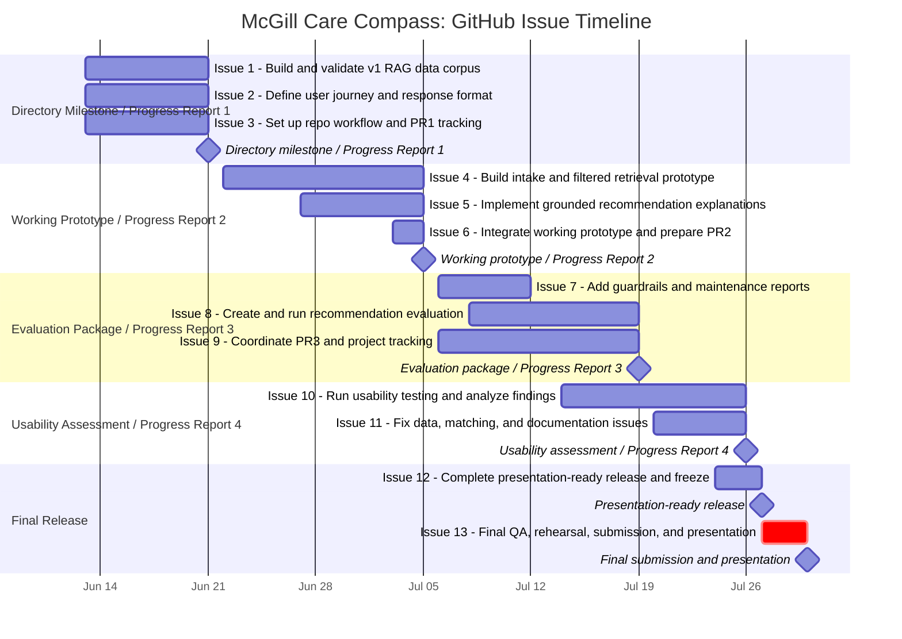

# McGill Care Compass: GitHub Issue-Based Task Breakdown

## Purpose

This document translates the approved teammate workload appendix into a smaller GitHub Issue structure that maps directly to the proposal Gantt chart and course milestones. Instead of creating one issue for every individual owner task, the repo should use **13 milestone-based issues**. The detailed `MH`, `MY`, and `AA` task IDs are retained as checkboxes inside each issue.

This structure is easier to manage on a GitHub board because each issue represents a visible project deliverable, while the checkboxes preserve accountability for the smaller work items.

## Relationship To Source Documents

This document is the bridge between the finalized high-level project plan, the teammate workload appendix, and the GitHub issue board:

- [Project-Plan-High-Level.md](Project-Plan-High-Level.md) summarizes the final milestone timeline and shared Gantt chart.
- [Team-Roles-and-Individual-Workload-Appendix.md](Team-Roles-and-Individual-Workload-Appendix.md) breaks the work into `MH`, `MY`, and `AA` task IDs with owners, dependencies, acceptance checks, and planned hours.
- [Project-Plan-High-Level.md](Project-Plan-High-Level.md) is the finalized source for the SMART deliverables and Gantt timeline.
- This file converts those detailed owner tasks into 13 GitHub-ready issues that map cleanly to the Gantt milestones while preserving the original `MH`, `MY`, and `AA` task IDs inside each issue.

## GitHub Issue Gantt Chart

This chart shows the 13 recommended GitHub issues as work bars and the major project milestones as milestone markers. The issue dates are grouped around visible deliverables rather than individual owner workstreams, so this can be used directly to set up the GitHub issue board.

## Recommended GitHub Setup

### GitHub Milestones

| GitHub Milestone | Due Date | Purpose |
| --- | --- | --- |
| Data Corpus Milestone / Progress Report 1 | June 21 | v1 RAG corpus, schema, quality checks, first progress evidence |
| Working Prototype / Progress Report 2 | July 5 | Intake flow, metadata-filtered retrieval, grounded results, integrated prototype |
| Evaluation Package / Progress Report 3 | July 19 | Guardrails, maintenance reports, scenario evaluation, internal deployment |
| Usability Assessment / Progress Report 4 | July 26 | Usability sessions, findings, priority fixes, documentation |
| Presentation-Ready Release | July 27 | Feature freeze, deployed app, maintenance package |
| Final Submission and Presentation | July 30 | Final QA, rehearsal, backup demo, final upload |

### Suggested Labels

Use labels to make the board scannable:

| Label | Use |
| --- | --- |
| `data` | RAG chunks, schema, source metadata, data validation |
| `matching` | Routing logic, scoring, tie handling, recommendation behavior |
| `ux` | Intake flow, interface, response layout, usability wording |
| `guardrails` | High-risk handling, unsupported cases, safety limitations |
| `evaluation` | Scenario tests, relevance rubric, evaluation results |
| `deployment` | App deployment, environment setup, health checks |
| `documentation` | README, setup instructions, schema docs, progress-report evidence |
| `progress-report` | Work needed for a course progress report |
| `qa` | Testing, release checks, final verification |
| `blocked` | Needs decision, review, data, or teammate input |

## Issue List

## Milestone: Directory Milestone / Progress Report 1

### Issue 1: Build and validate v1 RAG data corpus

**Due:** June 21  
**Primary owners:** Muhammad, with Abdelaziz review and Mustafa input  
**Maps to:** `MH-01`, `MH-02`, `MH-03`, `MH-04`  
**Suggested labels:** `data`, `matching`, `documentation`, `progress-report`

**Goal:** Produce the first complete v1 RAG data milestone: a validated, version-governed corpus that can support prototype retrieval and Progress Report 1.

**Detailed tasks:**

- [ ] Confirm the production RAG artifact schema.
- [ ] Lock the canonical service-category taxonomy.
- [ ] Define source-authority rules and required fields.
- [ ] Add or confirm fields for source URL, source owner, source publisher, license/terms reference, retrieved date, source-updated date, limitations, section headings, and retrieval fields.
- [ ] Build the reusable RAG corpus from official source seeds.
- [ ] Prioritize McGill, healthcare/wellness, Canada, and Quebec sources.
- [ ] Reach at least 500 processed pages.
- [ ] Reach at least 4,000 chunks.
- [ ] Include at least eight service categories.
- [ ] Include McGill, Canada, and Quebec source groups.
- [ ] Include healthcare, insurance, and wellness chunks.
- [ ] Build or refine validation checks for missing required fields.
- [ ] Check duplicate canonical URLs and chunk IDs.
- [ ] Check invalid or missing URLs.
- [ ] Check manifest hashes and version stamps.
- [ ] Check category consistency against the locked taxonomy.
- [ ] Check stale verification dates.
- [ ] Create a quality-summary report.
- [ ] Package the clean dataset, schema documentation, quality summary, and reproducible build/update commands for Progress Report 1.

**Acceptance check:**

- [ ] Validated Silver RAG corpus exists.
- [ ] Schema documentation exists.
- [ ] Quality summary exists.
- [ ] Reproducible build/update commands are documented.
- [ ] Abdelaziz/team review is complete.

### Issue 2: Define user journey and prototype response format

**Due:** June 21  
**Primary owner:** Mustafa, with Muhammad input and team review  
**Maps to:** `MY-01`, `MY-02`  
**Suggested labels:** `ux`, `guardrails`, `documentation`, `progress-report`

**Goal:** Define the user-facing flow before the prototype is built, including intake questions, result layout, response examples, limitation wording, and official-link presentation.

**Detailed tasks:**

- [ ] Define the primary newcomer-student user journey.
- [ ] Define supported user needs and out-of-scope situations.
- [ ] Draft structured intake questions.
- [ ] Ensure intake avoids sensitive identifiers and detailed health information.
- [ ] Define the recommendation-results layout.
- [ ] Define where match reasons, official source links, verification dates, and limitations appear.
- [ ] Create low-fidelity interface mockups.
- [ ] Create response examples for common newcomer scenarios.
- [ ] Include examples for healthcare, immigration/status, insurance, wellness, and unsupported cases.
- [ ] Review the examples with Muhammad to confirm available data fields support them.
- [ ] Review the wording with the full team.

**Acceptance check:**

- [ ] Team approves intake flow.
- [ ] Team approves recommendation layout.
- [ ] Team approves response examples.
- [ ] Flow covers supported needs without collecting sensitive personal information.

### Issue 3: Set up repo workflow and Progress Report 1 tracking

**Due:** June 21  
**Primary owner:** Abdelaziz, with team agreement  
**Maps to:** `AA-01`, `AA-02`, `AA-03`, part of `AA-04`  
**Suggested labels:** `documentation`, `progress-report`, `qa`

**Goal:** Make the repository manageable for team collaboration, progress reporting, review, and reproducible setup.

**Detailed tasks:**

- [ ] Convert this issue-based breakdown into GitHub Issues.
- [ ] Create GitHub Milestones matching the proposal timeline.
- [ ] Create labels for data, matching, UX, evaluation, deployment, documentation, progress reports, QA, and blockers.
- [ ] Assign each issue an owner, reviewer, due date, and milestone.
- [ ] Establish branching rules.
- [ ] Create or document pull-request expectations.
- [ ] Create a review checklist.
- [ ] Define the team's Definition of Done.
- [ ] Document repository structure.
- [ ] Document local setup assumptions.
- [ ] Start a risk and decision log.
- [ ] Track proposal-feedback fixes for Progress Report 1.
- [ ] Collect evidence from Issue 1 and Issue 2 for Progress Report 1.

**Acceptance check:**

- [ ] Every required issue is visible, assigned, dated, labeled, and tied to a milestone.
- [ ] Team can create, review, test, and merge changes using documented workflow rules.
- [ ] Progress Report 1 evidence is organized.

## Milestone: Working Prototype / Progress Report 2

### Issue 4: Build intake and filtered retrieval prototype

**Due:** July 5  
**Primary owners:** Muhammad and Mustafa  
**Maps to:** `MH-05`, `MH-06`, `MY-03`  
**Suggested labels:** `matching`, `ux`, `data`

**Goal:** Build the first working intake-to-ranked-results path using metadata filters, vector retrieval, and transparent ranking.

**Detailed tasks:**

- [ ] Define retrieval/filtering features from intake fields.
- [ ] Include need category, student type, urgency, location, language, and access preference where available.
- [ ] Write the routing precedence in clear if-then form.
- [ ] Define filter, ranking, and tie-breaking priorities.
- [ ] Define filters for unsupported or out-of-scope cases.
- [ ] Define tie-breaking logic.
- [ ] Define sensitive-topic and guardrail routing behavior.
- [ ] Implement ranked retrieval against the RAG corpus.
- [ ] Return match reasons for retrieved chunks/results.
- [ ] Return backup options when appropriate.
- [ ] Handle empty-result cases.
- [ ] Build the structured intake interface.
- [ ] Build the first results interface with placeholders or live retrieved chunks/results.
- [ ] Confirm the prototype uses production-format chunks and metadata.

**Acceptance check:**

- [ ] User can complete the intake.
- [ ] Prototype returns ranked source-grounded results.
- [ ] Each result includes a traceable match explanation.
- [ ] Empty and unsupported cases are handled gracefully.

### Issue 5: Implement grounded recommendation explanations

**Due:** July 5  
**Primary owner:** Mustafa, with Muhammad data contract support  
**Maps to:** `MY-04`  
**Suggested labels:** `ux`, `guardrails`, `matching`

**Goal:** Convert retrieved chunks/results into concise user-facing explanations grounded only in approved source content.

**Detailed tasks:**

- [ ] Define the explanation template.
- [ ] Include service name, why it matched, official next step, source link, and limitation wording.
- [ ] Ensure explanations do not make unsupported eligibility, medical, immigration, tax, or financial-aid claims.
- [ ] Include backup-option wording where retrieval returns a secondary path.
- [ ] Include source and verification-date display.
- [ ] Confirm explanations show source URL, source date, and terms metadata.
- [ ] Test explanations on common scenarios.
- [ ] Test explanations on high-risk and unsupported scenarios.

**Acceptance check:**

- [ ] Explanations use retrieved chunk content.
- [ ] Explanations include official links and limitations.
- [ ] Explanations make no unsupported claims.

### Issue 6: Integrate working prototype and prepare Progress Report 2

**Due:** July 5  
**Primary owner:** Abdelaziz, with Muhammad and Mustafa joint integration  
**Maps to:** `MH-07`, `MY-05`, `AA-05`  
**Suggested labels:** `deployment`, `matching`, `ux`, `progress-report`, `qa`

**Goal:** Merge the RAG corpus, retrieval/ranking layer, interface, and explanation layer into a demonstrable prototype by the July 5 milestone.

**Detailed tasks:**

- [ ] Define or confirm the data/interface contract between the RAG corpus, retrieval/ranking layer, and UI.
- [ ] Integrate the production-format RAG chunks/vector retrieval with the prototype.
- [ ] Integrate matched results with the explanation layer.
- [ ] Integrate the full flow into the prototype app.
- [ ] Confirm the app does not require manual data changes to return results.
- [ ] Run a pre-check using common student scenarios.
- [ ] Fix blocking integration defects.
- [ ] Tag or snapshot the working prototype state.
- [ ] Collect screenshots, test notes, and evidence for Progress Report 2.
- [ ] Update board status, risks, and blockers.

**Acceptance check:**

- [ ] Prototype reads production-format chunks and metadata.
- [ ] User receives ranked recommendations, match reasons, next steps, backup options, and source links.
- [ ] Working prototype is demonstrated or ready to demonstrate by July 5.

## Milestone: Evaluation Package / Progress Report 3

### Issue 7: Add guardrails and maintenance reports

**Due:** July 12  
**Primary owners:** Mustafa, Muhammad, and Abdelaziz  
**Maps to:** `MY-06`, `MH-08`, `AA-06`  
**Suggested labels:** `guardrails`, `data`, `deployment`, `qa`

**Goal:** Strengthen the prototype for risky cases, unsupported cases, maintenance visibility, and internal deployment.

**Detailed tasks:**

- [ ] Implement user-facing handling for high-risk scenarios.
- [ ] Implement unsupported-case handling.
- [ ] Implement empty-result handling.
- [ ] Implement system-error handling.
- [ ] Add medical, immigration, tax, and financial-aid limitation wording.
- [ ] Add source-freshness output.
- [ ] Add broken-link output.
- [ ] Add missing-data output.
- [ ] Add category-coverage output.
- [ ] Document how to run maintenance reports.
- [ ] Create internal deployed environment.
- [ ] Add basic health checks.
- [ ] Add basic error logging.
- [ ] Document deployment and rollback/update steps.

**Acceptance check:**

- [ ] High-risk and unsupported cases fail safely.
- [ ] Maintenance reports run from documented commands.
- [ ] Internal app URL or internal deployment target loads reliably.

### Issue 8: Create and run recommendation evaluation

**Due:** July 19  
**Primary owners:** Mustafa and Muhammad, with Abdelaziz test-workflow support  
**Maps to:** `MY-07`, `MY-08`, `MH-09`, `AA-08`  
**Suggested labels:** `evaluation`, `matching`, `guardrails`, `qa`

**Goal:** Make the 90% top-three relevance claim reproducible through a fixed scenario set, expected-result rubric, automated or repeatable tests, and documented results.

**Detailed tasks:**

- [ ] Create predefined evaluation scenarios.
- [ ] Cover normal newcomer-service journeys.
- [ ] Cover healthcare and wellness cases.
- [ ] Cover high-risk cases.
- [ ] Cover empty-result cases.
- [ ] Cover unsupported cases.
- [ ] Define expected categories for each scenario.
- [ ] Define acceptable services or service types for each scenario.
- [ ] Define what counts as a relevant top-three result.
- [ ] Define required safety messages and source-link checks.
- [ ] Run the evaluation.
- [ ] Document failures.
- [ ] Tune matching rules where needed.
- [ ] Rerun evaluation after fixes.
- [ ] Add automated or one-command test execution where feasible.
- [ ] Record final evaluation results for Progress Report 3.

**Acceptance check:**

- [ ] Scenario set exists and is fixed.
- [ ] Evaluation rubric exists.
- [ ] Results show at least 90% of predefined scenarios return a relevant service in the top three, or failures are clearly documented with fixes planned.
- [ ] Core tests can be run through one documented workflow.

### Issue 9: Coordinate Progress Report 3 and project tracking

**Due:** July 19  
**Primary owner:** Abdelaziz  
**Maps to:** `AA-07`  
**Suggested labels:** `documentation`, `progress-report`, `qa`

**Goal:** Keep the board, risks, decisions, blockers, and Progress Report 3 aligned with actual project status.

**Detailed tasks:**

- [ ] Update the GitHub board.
- [ ] Update milestone status.
- [ ] Update risk log.
- [ ] Update decision log.
- [ ] Identify blockers and assign owners.
- [ ] Confirm evaluation-readiness with Muhammad and Mustafa.
- [ ] Collect evidence from guardrails, maintenance reports, deployment, and evaluation work.
- [ ] Draft Progress Report 3.
- [ ] Confirm next goals and open blockers.

**Acceptance check:**

- [ ] No milestone-threatening blocker lacks an owner and action.
- [ ] Progress Report 3 is complete and accurate.

## Milestone: Usability Assessment / Progress Report 4

### Issue 10: Run usability testing and analyze findings

**Due:** July 26  
**Primary owners:** Mustafa and Abdelaziz, with team support  
**Maps to:** `MY-09`, `MY-10`, `MY-11`, `AA-09`  
**Suggested labels:** `ux`, `evaluation`, `progress-report`

**Goal:** Test the prototype with at least five target or proxy users, measure whether they can identify an appropriate next step, and convert findings into prioritized fixes.

**Detailed tasks:**

- [ ] Prepare usability-testing script.
- [ ] Prepare consent/privacy approach.
- [ ] Prepare feedback form.
- [ ] Prepare recruitment message.
- [ ] Schedule participants.
- [ ] Use target newcomer-cohort participants where possible.
- [ ] Use proxy users only if target recruitment is insufficient.
- [ ] Conduct at least five usability sessions.
- [ ] Record completion time.
- [ ] Record recommendation relevance feedback.
- [ ] Record explanation clarity feedback.
- [ ] Record confidence-change feedback.
- [ ] Record usefulness ratings.
- [ ] Analyze findings.
- [ ] Prioritize interface, wording, and flow improvements.
- [ ] Implement highest-priority UX and wording improvements.

**Acceptance check:**

- [ ] At least five completed anonymized test records are available.
- [ ] Findings report is complete.
- [ ] Critical usability issues are resolved or documented.

### Issue 11: Fix data, matching, and documentation issues from testing

**Due:** July 26  
**Primary owners:** Muhammad and Abdelaziz, with Mustafa feedback  
**Maps to:** `MH-10`, `AA-10`  
**Suggested labels:** `data`, `matching`, `documentation`, `qa`, `progress-report`

**Goal:** Resolve defects found during usability testing and complete the documentation needed for maintainability and Progress Report 4.

**Detailed tasks:**

- [ ] Review usability findings for data and matching issues.
- [ ] Fix critical data defects.
- [ ] Fix critical matching defects.
- [ ] Update limitations where the tool cannot support a need.
- [ ] Update source-provenance documentation where needed.
- [ ] Complete data update procedure.
- [ ] Complete matching/routing documentation.
- [ ] Complete README sections for setup, running, testing, assumptions, limitations, and maintenance.
- [ ] Confirm a new user can run the project from documented commands.
- [ ] Collect Progress Report 4 evidence.
- [ ] Coordinate final documentation review.

**Acceptance check:**

- [ ] No unresolved critical data or matching defect remains.
- [ ] Update procedure and limitations are documented.
- [ ] Repository documentation meets final-deliverable needs.
- [ ] Progress Report 4 evidence is complete.

## Milestone: Presentation-Ready Release

### Issue 12: Complete presentation-ready release and feature freeze

**Due:** July 27  
**Primary owner:** Abdelaziz, with whole-team support  
**Maps to:** `AA-11`  
**Suggested labels:** `deployment`, `documentation`, `qa`

**Goal:** Produce the presentation-ready release, enforce feature freeze, and make sure no unfinished required feature remains for the demo.

**Detailed tasks:**

- [ ] Complete production deployment.
- [ ] Confirm deployed app loads without errors.
- [ ] Integrate or confirm source-freshness dashboard.
- [ ] Confirm maintenance outputs work.
- [ ] Confirm required tests pass.
- [ ] Tag the release.
- [ ] Freeze new feature development.
- [ ] Move remaining non-critical improvements to future-work notes.
- [ ] Prepare final release notes.

**Acceptance check:**

- [ ] Deployed app works.
- [ ] Maintenance outputs work.
- [ ] Release is tagged.
- [ ] No unfinished required feature is needed for the demo.

## Milestone: Final Submission and Presentation

### Issue 13: Final QA, rehearsal, submission, and presentation

**Due:** July 30  
**Primary owner:** Whole team, coordinated by Abdelaziz and Mustafa  
**Maps to:** `MH-11`, `MY-12`, `AA-12`  
**Suggested labels:** `qa`, `documentation`, `deployment`

**Goal:** Complete final verification, rehearse the demo, prepare backup materials, and submit all required course materials.

**Detailed tasks:**

- [ ] Run full technical QA.
- [ ] Verify production dataset works in deployed app.
- [ ] Verify matching system works in deployed app.
- [ ] Verify backup demo works.
- [ ] Prepare final demo flow.
- [ ] Prepare final presentation visuals.
- [ ] Prepare speaker notes.
- [ ] Prepare backup screenshots or video.
- [ ] Prepare Q&A notes.
- [ ] Conduct timed rehearsal.
- [ ] Verify final repository state.
- [ ] Verify deliverable URL.
- [ ] Verify presentation materials.
- [ ] Verify all required course submission items.
- [ ] Complete final upload.

**Acceptance check:**

- [ ] All required materials are submitted and independently verified.
- [ ] Team is ready for live demo and Q&A.
- [ ] Backup demo is ready.

## Optional Contingency Issues

Create these only if the team wants visible buffer tracking or if a real milestone-threatening problem appears.

### Optional Issue: Data, matching, or source-change contingency

**Maps to:** `MH-C`  
**Use only for:** source changes, integration failures, data defects, matching defects, or urgent problems that threaten a milestone.

### Optional Issue: UX, response-quality, recruitment, or demo contingency

**Maps to:** `MY-C`  
**Use only for:** response-quality problems, interface problems, recruitment issues, usability-test issues, or demo blockers.

### Optional Issue: Integration, deployment, documentation, or submission contingency

**Maps to:** `AA-C`  
**Use only for:** integration failures, deployment problems, documentation gaps, scheduling issues, or final-submission blockers.

## Definition of Done For Each Issue

An issue is complete only when:

1. Its acceptance check is met.
2. Evidence is linked in the issue or related pull request.
3. Relevant tests or checks pass.
4. Shared behavior or shared artifacts have been reviewed by at least one teammate.
5. Documentation is updated when the issue changes setup, data, behavior, limitations, or maintenance steps.
6. The owner has logged work in the course Hour Tracker.
