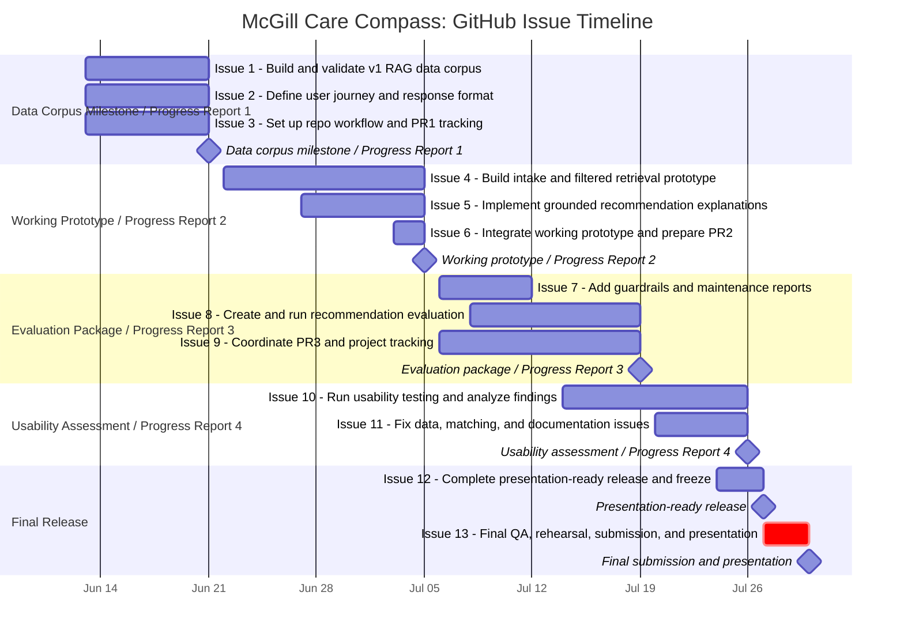

# Project Plan: High-Level Overview

## Purpose

This document is the high-level project plan for McGill Care Compass. It summarizes the milestone timeline, GitHub issue structure, team roles, delivery rules, and definition of done without replacing the issue-level task checklists or the teammate workload appendix.

Related documents:
- [Team-Roles-and-Individual-Workload-Appendix.md](../Appendices/Team-Roles-and-Individual-Workload-Appendix.md)
- [Product-Definition_McGill-Care-Compass-Newcomer-Service-Navigator.md](Product-Definition_McGill-Care-Compass-Newcomer-Service-Navigator.md)
## GitHub Issue And Milestone Gantt Chart

This chart matches the GitHub issues' structure so the finalized documents use one consistent issue-and-milestone timeline.

## Team Roles And Capacity

The three-person team contributes approximately 100 hours per member, for roughly 300 total project hours.

| Team member and role | Responsibilities | Estimated hours |
| --- | --- | --- |
| Muhammad Hydar-Ali - Data Engineering and Matching Systems Lead | RAG data acquisition, artifact schema, validation, freshness/drift checks, retrieval support, technical testing. | Data engineering: 35; validation/governance: 25; matching/retrieval: 20; testing/documentation: 10; contingency: 10; total: 100 |
| Mustafa Yousif - AI Engineering and User Experience Lead | Response layer, guardrails, evaluation scenarios, interface support, usability testing, final presentation support. | Agent/response development: 35; guardrails/evaluation: 20; interface/UX: 20; testing/presentation: 15; contingency: 10; total: 100 |
| Abdelaziz Ahmed - Project, Git-Flow, and MLOps Lead | Scope, milestones, risks, Git workflow, integration, deployment, documentation, stakeholder feedback, final delivery. | Project/risk coordination: 25; Git-flow/integration: 25; deployment/monitoring: 20; documentation/testing coordination: 15; requirements/data review: 5; contingency: 10; total: 100 |

## Delivery Rules

- July 5 is a hard working-prototype milestone.
- July 27 is feature freeze. After this date, only critical fixes should be accepted.
- July 28-29 are reserved for contingency, final QA, and rehearsal.
- Work that changes shared data schema, matching behavior, safety controls, or deployment should be reviewed before merge.
- Every completed issue should link evidence: dataset, screenshot, test output, report, PR, or documentation.
- The final repository must be runnable from documented commands.

## Definition Of Done

A project task or GitHub Issue is complete only when:

1. Its acceptance check is met.
2. Evidence is linked in the issue or related pull request.
3. Relevant tests or checks pass.
4. Shared behavior or shared artifacts have been reviewed by at least one teammate.
5. Documentation is updated when the issue changes setup, data, behavior, limitations, or maintenance steps.
6. The owner has logged work in the course Hour Tracker.
