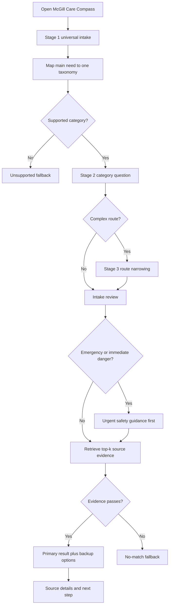
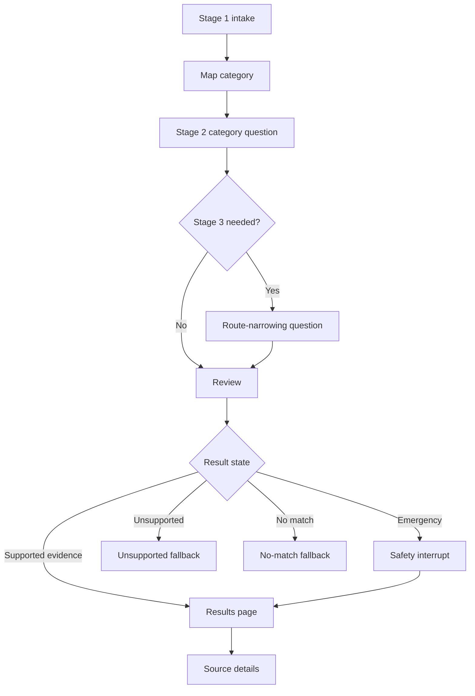

# User Journey and Prototype Response Format

This document is the Issue 2 UX contract for McGill Care Compass. It defines the newcomer-student journey, structured intake, interface flow, result layout, wording rules, and implementation handoff for the prototype. Detailed response examples live in [User-Journey-and-Prototype-Response-Examples-Appendix.md](../Appendices/User-Journey-and-Prototype-Response-Examples-Appendix.md).

## Purpose

The prototype should help a newcomer student move from "I do not know where to start" to a small set of official, source-grounded starting points. The experience must be structured, privacy-preserving, and conservative about high-risk topics.

This file is not the matching algorithm. It defines what the user sees and what the matcher/response layer must provide so the UI can safely display recommendations.

## Source Inputs Used

| Source area | What this UX contract uses |
| --- | --- |
| Product contract | Newcomer-student audience, low-risk structured intake, locked taxonomy, recommendation target, source links, and limitations. |
| Safety boundaries | No diagnosis, no legal/immigration/tax/insurance/financial eligibility decisions, no sensitive identifiers, and emergency-first routing. |
| Evaluation plan | Future scenario fields: student type, stage, urgency, expected category, source-link check, safety wording check, unsupported and no-match behavior. |
| RAG corpus contract | [`rag_chunks.csv`](../../data/silver/datasets/rag_chunks.csv), [`questionnaire_metadata_map.yml`](../../data/source-inputs/questionnaire_metadata_map.yml), source metadata, `review_status`, top-k evidence, Chroma retrieval, and provenance fields. |

The current data layer is a Silver RAG corpus. It is queryable, but `silver_unreviewed` chunks are not final approved recommendations. The UI must keep source links, limitation wording, and evidence checks visible.

## Core Journey

A newcomer student opens the navigator, answers a short structured intake, reviews the selected profile, and receives source-grounded starting points. The app should never ask the student to type a private narrative or prove status.



## Journey States

| State | Trigger | UI behavior | Required constraint |
| --- | --- | --- | --- |
| Supported path | Category and source evidence match the intake. | Show primary starting point, backup options, source links, and limitations. | Use retrieved evidence; do not invent service details. |
| High-risk path | Health, mental health, immigration, tax, insurance, financial aid, work authorization, housing dispute, or urgent support. | Show limitation wording near the top and inside affected results. | Do not make professional or eligibility decisions. |
| Emergency path | User selects emergency or immediate danger. | Show urgent safety guidance before normal results. | Safety resources come first; ordinary recommendations are secondary. |
| Unsupported path | Request is outside the locked taxonomy or asks for a decision the tool cannot make. | Show unsupported fallback and broad official starting point if available. | Do not improvise an answer. |
| No-match path | Retrieval returns weak, generic, contradictory, or insufficient evidence. | Tell the user no source-grounded match was found and offer intake edits. | Do not fabricate sources, deadlines, eligibility, or contacts. |

## Supported Taxonomy

| Category ID            | User label                           | Supported navigation intent                                                                         | Example starting points                                          |
| ---------------------- | ------------------------------------ | --------------------------------------------------------------------------------------------------- | ---------------------------------------------------------------- |
| `health_care`          | Healthcare access                    | Find official routes for campus care, Quebec care, regular-provider access, or nearby-care context. | Student Wellness Hub, Info-Sante 811, Primary Care Access Point. |
| `mental_health`        | Mental health and wellbeing          | Find wellness, crisis, community, or mental-health support routes.                                  | Student Wellness Hub, crisis resources, Info-Social 811.         |
| `insurance`            | Health insurance and coverage        | Find IHI, RAMQ, coverage, claim/contact, or insurer starting points.                                | McGill IHI, RAMQ, Medavie Blue Cross.                            |
| `immigration_status`   | Immigration and legal status         | Find official office, government, referral, or process-starting resources.                          | ISS, IRCC, Quebec pages, legal referrals.                        |
| `housing`              | Housing and basic needs              | Find housing search, off-campus housing, tenant information, or basic-needs routes.                 | Off-Campus Housing, Quebec newcomer housing guidance.            |
| `academics`            | Academic and advising support        | Find advising, planning, study support, or library help.                                            | Faculty advising, McGill Libraries.                              |
| `finances`             | Financial aid and affordability      | Find funding, aid advising, emergency support, or affordability resources.                          | Scholarships and Student Aid.                                    |
| `work_career`          | Work and career support              | Find career advising, job search, or official work-rule resources.                                  | CaPS, ISS work pages, Service Canada.                            |
| `tax`                  | Tax filing and residency information | Find CRA/student tax information or tax clinic support.                                             | CRA student pages, free tax clinics.                             |
| `documents_admin`      | Campus documents and administration  | Find Service Point, student account, record, ID, fee, or billing help.                              | Service Point, Student Accounts.                                 |
| `language_integration` | Language and integration             | Find orientation, language learning, peer/community, or settlement routes.                          | Campus Life and Engagement, community resources.                 |
| `safety_urgent`        | Urgent or safety-related help        | Route urgent cases to emergency, crisis, or urgent-care guidance.                                   | 911, crisis lines, urgent care pages.                            |

## Out-Of-Scope Handling

| Request type | Why it is out of scope | Correct handling |
| --- | --- | --- |
| Diagnosis, symptom triage, or treatment | Requires clinical judgment. | Show emergency/healthcare starting points and limitation wording. |
| Immigration or legal interpretation | Requires qualified advice or official decision. | Link to official pages, ISS, government, or legal-referral resources. |
| Tax residency, filing obligation, deductions, credits, or refunds | Requires tax-specific judgment. | Link to CRA/student tax information or tax clinics. |
| Insurance coverage, reimbursement, exemption, or claim outcome | Requires insurer or administrator decision. | Link to IHI, RAMQ, insurer, or official contact routes. |
| Financial-aid eligibility, award amount, or outcome | Requires official financial-aid review. | Link to Scholarships and Student Aid or emergency support. |
| Work authorization or permit-condition decision | Requires official immigration/work-rule interpretation. | Link to official work guidance and qualified support. |
| Private crisis narrative or highly sensitive disclosure | May require immediate human support and should not be stored. | Show urgent resources and avoid collecting details. |
| General chatbot request unrelated to newcomer service navigation | Outside product scope. | Show unsupported fallback and broad McGill starting point if evidence exists. |

## Intake Design Rules

- Use pre-written controls: select boxes, radio groups, segmented controls, and checkboxes.
- Avoid unrestricted free text in the MVP.
- Always offer "unsure" where a student may not know an answer.
- Show only one Stage 2 category questionnaire after the main need maps to a taxonomy.
- Show Stage 3 only for complex categories where one extra route question materially improves routing.
- Treat urgency/high-risk answers as routing signals, not professional determinations.
- Do not ask for student ID, SIN, passport number, medical record number, policy number, claim details, diagnosis, symptoms, exact income, account credentials, document images, or legal facts.

## Stage 1 Universal Intake

These questions appear for every student and define the initial profile and routing context.

| ID | User-facing label | Allowed values | Downstream use | Must not decide |
| --- | --- | --- | --- | --- |
| `mcgill_relationship` | What is your relationship to McGill right now? | admitted/incoming; current student; exchange/visiting; recently graduated/leaving; supporting a student; unsure | Intended-user fit and McGill-service priority. | Enrolment validity or access rights. |
| `academic_level` | What academic level best fits you? | undergraduate; graduate; exchange/visiting; not sure; not applicable | Advising, funding, academic, and wording context. | Academic standing or program eligibility. |
| `newcomer_context` | Which newcomer context best fits your situation? | international student; permanent resident/new Canadian; Canadian student new to Quebec/Montreal; refugee/asylum-seeker context; unsure; prefer not to say | Student profile, settlement, government, insurance, and wording context. | Legal or immigration status. |
| `current_stage` | Where are you in your McGill journey? | pre-arrival; newly arrived; first term; continuing; graduating/leaving; unsure | Arrival/continuing/transition wording and ranking. | Deadlines or eligibility windows. |
| `main_need` | What do you need help navigating first? | one locked taxonomy category or something else | Category mapping and Stage 2 selection. | Professional judgment or service approval. |
| `jurisdiction_context` | Which system do you think this is about? | McGill; Quebec; Canada; community/external; not sure | RAG jurisdiction filter or ranking preference. | Legal jurisdiction or official responsibility. |
| `urgency_level` | How urgent is this? | emergency/immediate danger; urgent not emergency; routine; planning ahead; unsure | Safety interrupt and result ordering. | Medical or crisis triage. |
| `campus_location` | Which location is most relevant? | Downtown; Macdonald; off campus in Montreal; outside Montreal; online/remote; unsure | Campus or location-aware routing. | Address, residence, or eligibility. |
| `language_preference` | What language would you prefer for support? | English; French; English/French; another language; no preference | Language-aware wording and source display. | Guaranteed service language. |
| `delivery_preference` | How would you prefer to start? | online; phone; in person; email/web form; no preference; unsure | Access-method ranking and presentation. | Availability or appointment access. |

## Stage 2 And Stage 3 Matrix

Only the row for the mapped category is shown. Stage 3 narrows the route only; it never decides coverage, status, obligation, diagnosis, authorization, aid eligibility, or service approval.

| Category | Stage 2 question | Stage 2 values | Stage 3? | Stage 3 values | Do not ask |
| --- | --- | --- | --- | --- | --- |
| `health_care` | What kind of healthcare navigation do you need? | where to start; campus care; outside-hours care; family doctor/regular provider; nearby facility; unsure | Yes: access context | IHI; RAMQ; private insurance; out-of-province coverage; no coverage; unsure | symptoms, diagnosis, medication, medical history, policy numbers. |
| `mental_health` | What kind of support are you looking for? | immediate support; routine wellness; community resource; online option; unsure | No | Not applicable | diagnosis, self-harm narrative, risk assessment details. |
| `insurance` | What insurance topic are you trying to navigate? | activate coverage; benefits; claims/contact route; RAMQ/public coverage; unsure | Yes: coverage context | IHI; RAMQ; private; out-of-province; no coverage; unsure | policy numbers, claim details, reimbursement decisions. |
| `immigration_status` | What official information do you need? | McGill support; government information; legal referral; document/process starting point; unsure | Yes when route remains broad | McGill office/advisor; government page; legal/referral; checklist; unsure | document images, permit numbers, passport numbers, legal facts. |
| `housing` | What housing/basic-needs support do you need? | find housing; off-campus support; tenant information; emergency/basic needs; unsure | No | Not applicable | address, landlord details, legal dispute narrative. |
| `academics` | What academic support do you need? | advising; course/program planning; study support; library/research help; unsure | No | Not applicable | grades, transcripts, disciplinary details. |
| `finances` | What financial support are you trying to find? | scholarships/awards; aid advising; emergency/basic needs; budgeting; unsure | Yes for aid/emergency/application routes | application info; advising/contact; emergency support; affordability resource; unsure | exact income, bank details, account numbers, award outcomes. |
| `work_career` | What work/career topic do you need? | career advising; job search; on-campus work; off-campus work; unsure | Yes for work/job routes | advising appointment; official work rules; job-search resource; workshop/event; unsure | permit interpretation, authorization decision, employer legal facts. |
| `tax` | What tax topic are you trying to navigate? | general student tax; learning to file; clinic help; residency information; unsure | Yes for filing/clinic/residency routes | official info; tax clinic; checklist; contact route; unsure | SIN, income details, residency decision facts, filing decisions. |
| `documents_admin` | What campus administration task do you need help with? | Service Point; account; enrolment/records; ID/documents; fees/billing; unsure | No | Not applicable | student number, credentials, screenshots, private records. |
| `language_integration` | What language/integration support are you looking for? | orientation; language learning; peer/community connection; settlement integration; unsure | No | Not applicable | status proof, detailed personal history. |
| `safety_urgent` | What urgent help should be prioritized? | emergency/immediate danger; crisis support; urgent healthcare; urgent mental-health support; unsure | No | Not applicable | incident narrative, symptom details, risk assessment details. |

## Applicability And Evidence Fit

The app may narrow and rank evidence, but it cannot decide official eligibility. Use these internal statuses for result handling.

| Status | Meaning | User-facing treatment |
| --- | --- | --- |
| `clearly_applicable` | Evidence matches category, subtype, and available profile signals. | Show as strong starting point with source and limits. |
| `possibly_applicable` | Evidence may fit, but details are broad, unknown, or source-dependent. | Show as backup or lower-ranked option. |
| `not_applicable` | Selected answers clearly point away from the source route. | Do not show as recommendation. |
| `needs_official_confirmation` | Evidence is relevant but outcome depends on an office, official source, or qualified professional. | Say the source lists criteria that may apply and direct user to confirm. |
| `insufficient_information` | Structured intake is too broad for confident narrowing. | Ask user to adjust intake or show no-match fallback. |

High-risk categories should default to `needs_official_confirmation` unless a later reviewed contract proves a more specific non-professional routing status is safe.

## RAG Profile Contract

The UI stores selected answer IDs and derived filters, not sensitive free text. `need_type` maps to chunk `info_type_tags` and boolean metadata. Legacy `risk_level` is derived by the system and should be treated as topic sensitivity, not actual chunk danger.

```json
{
  "selected_answers": {
    "stage_1_universal": {
      "mcgill_relationship": "current_student",
      "academic_level": "graduate",
      "newcomer_context": "international_student",
      "current_stage": "newly_arrived",
      "main_need": "insurance",
      "jurisdiction_context": "mcgill",
      "urgency_level": "routine",
      "campus_location": "downtown",
      "language_preference": "en",
      "delivery_preference": "online"
    },
    "stage_2_taxonomy": {
      "category_id": "insurance",
      "need_type": "costs_coverage"
    },
    "stage_3_route_narrowing": {
      "shown": true,
      "answer": "ihi"
    }
  },
  "derived_rag_filters": {
    "category_id": "insurance",
    "student_type": "international_student",
    "jurisdiction": "mcgill",
    "language": "en",
    "risk_level": "high_risk",
    "info_type_tags": ["costs_coverage"],
    "has_costs_coverage": true
  }
}
```

| Profile area | Purpose | Boundary |
| --- | --- | --- |
| Stage 1 answers | Universal profile, urgency, source context, language, and access preference. | Stable IDs only; no private identifiers. |
| Stage 2 answer | One category-specific need subtype. | Never include answers from unrelated categories. |
| Stage 3 answer | Optional route-narrowing context for complex categories. | Narrows route only; does not decide official outcomes. |
| Derived filters | Metadata filter before vector search. | Do not expose `risk_level` as user-selected risk. |
| Evidence set | Top-k chunks with source metadata and ranking scores. | Must pass evidence check before response writing. |

## Need-Type Mapping

| User/profile `need_type` | Chunk tag | Boolean filter |
| --- | --- | --- |
| `contact` | `contact` | `has_contact_info` |
| `required_docs` | `required_docs` | `has_required_docs` |
| `eligibility` | `eligibility` | `has_eligibility` |
| `costs_coverage` | `costs_coverage` | `has_costs_coverage` |
| `location` | `location` | `has_location` |
| `deadlines` | `deadlines` | `has_deadlines` |
| `booking_steps` | `booking_steps` | `has_booking_steps` |
| `emergency_info` | `emergency_info` | `has_emergency_info` |
| `general_navigation` | no required tag | no required boolean; use category and semantic search. |

## Evidence Requirements

Issue 4 should return a top-k evidence set, not a single best vector. Each evidence item should include `chunk_id`, `vector_id`, `chunk_text`, `heading_path`, `canonical_url`, `source_publisher`, `authority_level`, `review_status`, `label_method`, `label_confidence`, `retrieved_at`, matched filters, and ranking score.

The response layer must fail the evidence set when top chunks are boilerplate-heavy, generic, contradictory, outside the selected category, or too weak to support a concrete next step. User-facing summaries should come from `chunk_text` and safe source metadata. Debug-only fields such as hashes, token counts, `chunk_id`, `vector_id`, `label_method`, and `label_confidence` should stay out of the normal student UI.

## Interface Flow



### Intake Review

Before retrieval, show a compact review block:

```text
You selected:
- Relationship: Current McGill student
- Academic level: Graduate
- Newcomer context: International student
- Stage: Newly arrived
- Need: Healthcare access
- Source context: McGill
- Urgency: Routine
- Location: Downtown campus
- Language: English
- Start preference: Online
- Follow-up shown: Healthcare questionnaire only
- Route context: McGill IHI

The navigator will use these structured choices to find source-linked services.
It will not ask unrelated follow-up questions or collect private identifiers.
```

## Result Layout

Results should be compact, scannable, and source-grounded.

| Display field | Evidence source | Rule |
| --- | --- | --- |
| Primary starting point | Source title, heading path, or office/service name from evidence. | Use the clearest official route supported by chunks. |
| Category | `category_id` and label. | Show near title. |
| Why this matched | Intake answers plus matched metadata and chunk evidence. | Explain without saying the student qualifies. |
| Recommended next step | Retrieved `chunk_text` and source context. | Must be a concrete source-derived action. |
| Important limit | Topic template plus evidence status. | Required for high-risk and `silver_unreviewed` cases. |
| Official source | `canonical_url`. | Always visible. |
| Source details | Publisher, terms, retrieved/source-updated date. | Show in compact expandable table. |
| Developer evidence | chunk IDs, vector IDs, review status, label method/confidence. | Keep in debug/evaluation views, not normal UI. |

### Standard Results Wireframe

```text
+-------------------------------------------------------------+
| Recommended starting points                                 |
| Based on: Healthcare access, routine, Downtown, IHI context  |
+-------------------------------------------------------------+
| Primary starting point                                      |
| [Official route or source title]                            |
| Category: Healthcare access                                 |
| Why this matched: [profile + category + source reason]       |
| Next step: [source-derived action]                           |
| Important limit: [topic/evidence limitation]                 |
| Official source: [open source]                               |
| Last checked: [date]                                         |
| [View source details]                                        |
+-------------------------------------------------------------+
| Backup options                                              |
| 1. [service/source] - [short reason] - [source link]          |
| 2. [service/source] - [short reason] - [source link]          |
+-------------------------------------------------------------+
```

### Safety Interrupt Wireframe

```text
+-------------------------------------------------------------+
| Urgent safety guidance                                      |
+-------------------------------------------------------------+
| If this is an emergency or there is immediate danger, call   |
| 911 or go to the nearest emergency department.               |
|                                                             |
| This navigator cannot diagnose symptoms, decide whether a    |
| condition is an emergency, or replace emergency services.    |
| Official resources may appear below as secondary follow-up.  |
+-------------------------------------------------------------+
```

### Fallback Wireframes

```text
Unsupported request
This request is outside the current navigator categories or asks for a professional decision. Try a supported category or start with an official McGill student-service contact point.
```

```text
No source-grounded match found
The navigator did not find enough official evidence for these choices. It will not invent a service. Try broadening the intake or start with an official McGill student-service contact point.
```

## Wording Standards

Use plain, conservative, action-oriented wording.

| Use | Avoid |
| --- | --- |
| "Start here..." | "You qualify..." |
| "The official source says..." | "Coverage is confirmed..." |
| "This may be a useful starting point..." | "This is the correct answer..." |
| "Confirm with the responsible office or service." | "This guarantees..." |
| "The navigator cannot decide this for you." | "Approved by a human reviewer for your case." |

Standard match reason:

```text
This matched because you selected [main need], [profile fields], and [follow-up]. It is an official [publisher/category] starting point for [purpose].
```

Standard next step:

```text
Start with this action: [specific source-derived action]. Use the official source to verify availability, cost, documents, timing, or eligibility caveats with the responsible office or service.
```

## Limitation Templates

| Topic | Template |
| --- | --- |
| Healthcare | This navigator can point you to official healthcare starting points, but it cannot diagnose symptoms, recommend treatment, or decide whether care is urgent. |
| Mental health | This navigator can point you to support resources, but it cannot assess risk, diagnose, or replace crisis or clinical support. |
| Emergency | If this is an emergency or immediate danger, call 911 or go to the nearest emergency department. Regular navigator results are secondary. |
| Immigration | This navigator can link to official immigration and student-service resources, but it cannot interpret documents, decide status, or provide legal advice. |
| Tax | This navigator can link to CRA and student tax resources, but it cannot decide tax residency, filing obligations, credits, deductions, or refunds. |
| Insurance | This navigator can link to official insurance resources, but it cannot decide coverage, reimbursement, exemptions, or claim outcomes. |
| Financial aid | This navigator can link to funding and support resources, but it cannot decide financial-aid eligibility, award amounts, or application outcomes. |
| Employment | This navigator can link to career and official work resources, but it cannot interpret permit conditions or decide work authorization. |
| Housing | This navigator can link to housing and tenant-information resources, but it cannot provide legal advice or decide a dispute. |
| Unsupported | This navigator does not have source-grounded evidence for that request. It will not invent a recommendation. |
## Response example: Activate International Health Insurance

**Expected category:** `insurance`

**Primary starting point:** McGill International Student Services - Activate IHI Coverage.

**Backup option:** Contact the International Student Services health insurance team or Medavie Blue Cross if Minerva confirmation does not work.

**Why this matched:** You asked how to start using McGill International Health Insurance, and the retrieved source route explains the Minerva activation process.

**Recommended next step:** Log in to Minerva with your student ID, open the Student tab, choose the International Health Insurance Menu, select Confirm IHI Coverage, and then print your IHI card. Have your McGill student ID ready. This should take about 10 minutes. For more information, visit the official page or call 555-0101.

**Important limit:** This does not decide whether every health expense is covered. Confirm coverage details with the official source or insurer.

**Official sources:**

- [https://www.mcgill.ca/internationalstudents/health/activate-ihi-coverage](https://www.mcgill.ca/internationalstudents/health/activate-ihi-coverage)

**Last verified:** 2026-06-24

**Source details:**

|Source|Publisher|Terms|Last retrieved|
|---|---|---|---|
|Activate IHI Coverage|McGill University|[https://www.mcgill.ca/copyright/](https://www.mcgill.ca/copyright/)|2026-06-24T07:40:10+00:00|

## Current Assumptions

- Intake questions are pre-written; the system does not generate new follow-ups from user wording.
- Users see Stage 1, exactly one Stage 2 category questionnaire, and optional Stage 3 only for `health_care`, `insurance`, `immigration_status`, `finances`, `work_career`, and `tax`.
- Delivery preference affects ranking and presentation, not eligibility or availability.
- Applicability/profile fit narrows evidence; it does not decide official outcomes.
- The MVP avoids sensitive free text and private identifiers.
- The corpus is Silver and `silver_unreviewed`; prototype answers must display limits and source grounding.

**Expected category:** `insurance`

**Primary starting point:** McGill International Student Services - Activate IHI Coverage.

**Backup option:** Contact the International Student Services health insurance team or Medavie Blue Cross if Minerva confirmation does not work.

**Why this matched:** You asked how to start using McGill International Health Insurance, and the retrieved source route explains the Minerva activation process.

**Recommended next step:** Log in to Minerva with your student ID, open the Student tab, choose the International Health Insurance Menu, select Confirm IHI Coverage, and then print your IHI card. Have your McGill student ID ready. This should take about 10 minutes. For more information, visit the official page or call 555-0101.

**Important limit:** This does not decide whether every health expense is covered. Confirm coverage details with the official source or insurer.

**Official sources:**

- [https://www.mcgill.ca/internationalstudents/health/activate-ihi-coverage](https://www.mcgill.ca/internationalstudents/health/activate-ihi-coverage)

**Last verified:** 2026-06-24

**Source details:**

|Source|Publisher|Terms|Last retrieved|
|---|---|---|---|
|Activate IHI Coverage|McGill University|[https://www.mcgill.ca/copyright/](https://www.mcgill.ca/copyright/)|2026-06-24T07:40:10+00:00|


## Review Checklist

| Reviewer | Must confirm |
| --- | --- |
| Mustafa | Journey, supported needs, intake flow, result layout, wording standards, mockups, and examples are usable for the prototype. |
| Muhammad | Intake fields map to [`questionnaire_metadata_map.yml`](../../data/source-inputs/questionnaire_metadata_map.yml), [`rag_chunks.csv`](../../data/silver/datasets/rag_chunks.csv), metadata filters, and top-k retrieval evidence. |
| Team | High-risk wording, source display, privacy boundaries, and response examples are approved for Issue 4 implementation. |

## Handoff

- Issue 4 should implement the intake, metadata filters, top-k evidence set, and result states defined here.
- Issue 5 should use the result layout, wording standards, and appendix examples as the explanation-layer contract.
- Issue 7 should convert emergency, high-risk, unsupported, and no-match behavior into guardrail checks.
- Issue 8 should convert the appendix examples into evaluation scenarios with expected category, source-link, evidence-pass, and safety-note checks.
