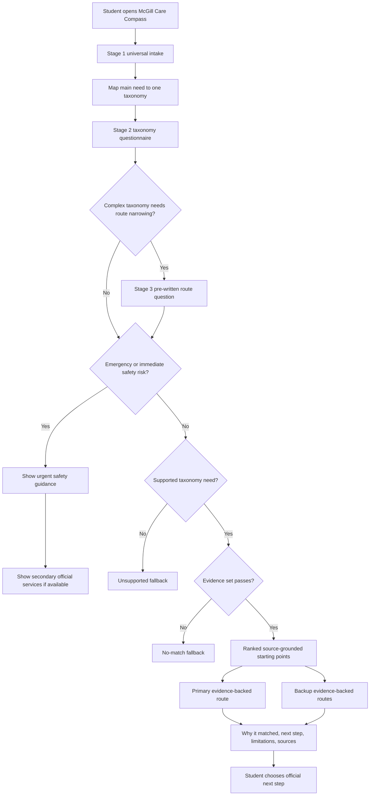
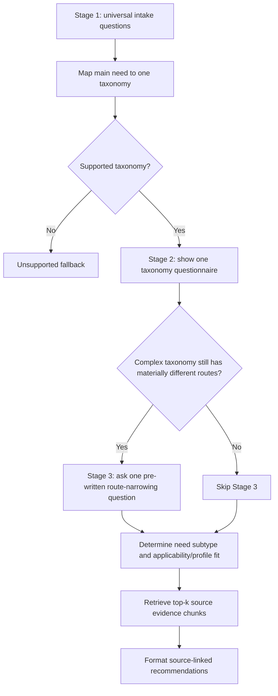
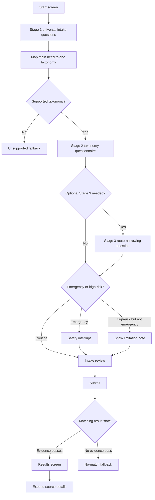
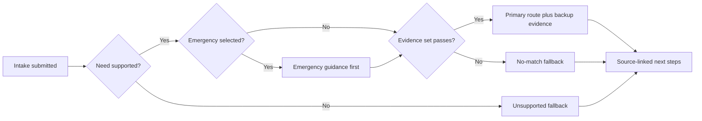

# User Journey and Prototype Response Format

Issue 2 UX contract covering user journey, intake questions, response layout,
wording standards, mockups, and examples.

## Purpose And Issue Mapping

This document defines the user-facing flow for McGill Care Compass before the
prototype is implemented. It satisfies Issue 2, including Mustafa's `MY-01` and
`MY-02` responsibilities:

- `MY-01`: Define the primary user journey, intake questions, interface flow,
  recommendation layout, and user-facing wording standards.
- `MY-02`: Create low-fidelity interface mockups and response examples for
  common newcomer scenarios.

The goal is to make the first prototype buildable without guessing how the
intake, results, safety wording, and source display should work.

This document depends on these project sources:

- Product definition: users, intake design, locked taxonomy, recommendation
  target, and matching expectations.
- Risk, assumptions, and safety boundaries: no professional advice, high-risk
  boundaries, source authority, and privacy limits.
- Evaluation and usability plan: scenario coverage, top-three relevance target,
  and future evaluation fields.
- Issue 1 RAG corpus contract: committed source pages, link graph,
  header-aware chunks, questionnaire metadata labels, retrieval examples,
  and source/provenance fields.

This document is not a production matching specification. It describes what the
user should see and what information the matcher and response layer must provide
later.

## Source Inputs Used

### Product Definition Inputs

The product definition establishes that McGill Care Compass is a structured
service navigator for newcomer students at McGill. It should help students find
the right official starting point without becoming an open-ended advice chatbot.

Key requirements carried into this document:

- The user is a newcomer student who may be new to McGill, Montreal, Quebec, or
  Canada.
- The tool should convert a student's situation into a small ranked set of
  source-grounded starting points.
- Recommendations must include official next steps, official source links,
  match reasons, limitations, and verification/provenance information.
- The intake should use structured, low-risk questions and avoid detailed
  private information.
- The locked taxonomy must be shared across intake, data, matching, UI, and
  evaluation.

### Safety And Privacy Inputs

The risk and safety documents establish that the navigator must not replace
advisors, clinicians, lawyers, government agencies, tax professionals, insurance
administrators, or financial-aid decision makers.

Key constraints carried into this document:

- Do not diagnose, triage symptoms, recommend treatment, or decide whether a
  condition is an emergency.
- Do not interpret immigration documents or legal status.
- Do not determine tax residency, tax filing obligations, deductions, credits,
  or refunds.
- Do not decide insurance coverage, reimbursement, exemptions, or claim
  outcomes.
- Do not decide financial-aid eligibility, award amounts, or application
  outcomes.
- Do not decide whether a student can work under immigration or permit rules.
- Do not collect sensitive identifiers such as student ID, SIN, passport number,
  medical record number, or financial account details.
- Avoid detailed health descriptions, detailed financial information, and
  stored sensitive free text.

### Evaluation Inputs

The evaluation plan requires future scenarios to include structured fields such
as student type, stage, urgency level, expected categories, acceptable services,
safety-note requirements, source-link requirements, and pass/fail rules.

The Issue 2 flow should therefore capture enough structured context to support:

- top-three relevance checks;
- source-link checks;
- safety wording checks;
- unsupported-case handling;
- empty-result handling;
- usability testing around whether users can identify an appropriate next step.

### Issue 1 RAG Data Contract Inputs

Issue 1 now provides the v1 Silver RAG corpus, not the old curated-directory
model. Issue 2 should design around retrieved source chunks
and evidence sets.

Active Issue 1 artifacts:

| Artifact | UX / response-format use |
| --- | --- |
| `data/source-inputs/questionnaire_metadata_map.yml` | Shared questionnaire IDs, category IDs, need types, and keyword/tag mapping. |
| `data/source-inputs/rag_seed_urls.csv` | Official source URL inventory, source ownership, crawl boundaries, and source terms. |
| `data/silver/datasets/rag_pages.csv` | Page-level source/provenance, freshness, and drift metadata. |
| `data/silver/datasets/rag_links.csv` | Link graph and crawl-decision metadata for source discovery and auditing. |
| `data/silver/datasets/rag_chunks.csv` | Primary reviewable retrieval table for filtered vector search and response grounding. |
| `data/silver/reports/rag_pipeline_report.md` | Run summary and current corpus counts. |
| `data/silver/reports/rag_corpus_quality_report.md` | Corpus-cleaning warnings to consider before using chunks in user-facing answers. |
| `data/silver/reports/rag_retrieval_examples.md` | Handoff examples showing filters, retrieved chunks, source URLs, and evidence checks. |
| `data/silver/reports/rag_run_manifest.json` | Machine-readable run manifest, config hashes, row counts, and artifact hashes. |
| `data/silver/vector_store/chroma/` | Local ignored Chroma index rebuilt from committed `rag_chunks.csv`. |

The current Issue 1 output is a Silver corpus. It is processed and queryable,
but chunks are `silver_unreviewed`; final Gold approval and evaluation are
future work. Prototype answers may use Silver chunks for testing only when the
response layer keeps limitation wording, source citations, and evidence checks
visible.

#### Request Taxonomy v0.1 / Implementation Contract Summary

The intake and retrieval layers should use these shared field names.

| Contract item | Canonical field or artifact | Notes |
| --- | --- | --- |
| Main category | `category_id` | Stable values come from `questionnaire_metadata_map.yml`. |
| User need subtype | `need_type` | User/profile concept; maps to chunk `info_type_tags` and boolean metadata fields. |
| Student profile | `student_type` | Examples: `international_student`, `newcomer`, or broader mapped values from the questionnaire config. |
| Jurisdiction / source context | `jurisdiction` | Examples: `mcgill`, `quebec`, `canada`. |
| Language | `language` | Current corpus is English-first; use stable language codes. |
| Topic sensitivity | legacy `risk_level` | Treat as topic sensitivity, not actual chunk danger; app logic may eventually use taxonomy directly. |
| Chunk review state | `review_status` | Current v1 default is `silver_unreviewed`. |
| Label provenance | `label_method`, `label_confidence` | Current v1 uses deterministic keyword labels and confidence from rule strength. |
| Vector identity | `vector_id` | Current v1 sets `vector_id = chunk_id`; Chroma is rebuilt from `rag_chunks.csv`. |

The response layer should not treat a source URL as the whole answer. It should
use retrieved chunks to form concrete, source-grounded next steps such as a
booking route, application step, required-document list, contact path,
deadline, cost/coverage note, or confirmation step. Source links verify and
support the action; they do not replace the action.

## Primary User Journey

The primary journey starts with a newcomer student who knows they need help but
does not know which McGill, Quebec, federal, healthcare, or community service to
start with.

### Main Journey

1. The student opens McGill Care Compass.
2. The student sees a concise intake that asks structured questions only.
3. The student selects universal profile fields, stage, main need, urgency,
   location, language preference, and delivery preference.
4. The tool maps the main need to one locked taxonomy and shows only that
   taxonomy's Stage 2 questionnaire.
5. If the taxonomy is complex and still has materially different routes, the
   tool shows one optional pre-written Stage 3 route-narrowing question.
6. If the intake indicates emergency, immediate safety risk, or a high-risk
   professional-judgment situation, the tool shows safety guidance before normal
   results.
7. The student submits the intake.
8. The tool returns a small ranked set of recommendations.
9. The first result is the primary starting point.
10. Backup results are shown below the primary result.
11. Every result includes why it matched, the next step, limitations, official
   source links, source publisher, and last checked date.
12. The student can expand source details for provenance and confidence.
13. If no evidence set fits, the tool shows a no-match fallback instead of
    inventing a service.

### Journey States

| State | Trigger | User experience | Required behavior |
| --- | --- | --- | --- |
| Normal supported path | Intake maps to a filtered set of source chunks. | Student sees ranked results and next steps. | Show primary result, backup evidence, source links, and limitations. |
| High-risk path | Need involves health, mental health, immigration, tax, insurance, financial aid, employment authorization, or urgent safety. | Student sees limitation wording near the top of the page and on relevant results. | Avoid professional judgment and direct the student to qualified official services. |
| Emergency path | Urgency is emergency or immediate danger. | Student sees urgent safety guidance before other results. | Prioritize emergency/crisis instructions and make normal results secondary. |
| Unsupported path | Need is outside the locked taxonomy or asks for a decision the tool cannot make. | Student sees a clear fallback and official next-step direction where possible. | Do not improvise advice or fabricate recommendations. |
| Empty or low-confidence path | No retrieved evidence set safely matches the selected context. | Student sees a useful fallback and suggestion to contact an official McGill starting point. | Explain that no source-grounded match is available and avoid invented services. |

### Journey Flowchart



## Supported Needs And Out-Of-Scope Situations

### Supported Taxonomy

The intake, results UI, response examples, and future evaluation scenarios
should use the locked taxonomy below.

| Category ID | User-facing label | Supported navigation intent | Example starting points |
| --- | --- | --- | --- |
| `health_care` | Healthcare access | Find official routes for care access, family doctor registration, primary care, or campus/off-campus healthcare navigation. | Student Wellness Hub, Info-Sante 811, Primary Care Access Point, Quebec Family Doctor Finder |
| `mental_health` | Mental health and wellbeing | Find wellness, crisis, community, or mental-health support routes without diagnosis or treatment advice. | Student Wellness Hub, I need help now, Info-Social 811, community resources |
| `insurance` | Health insurance and coverage | Find official insurance pages and contact routes for IHI, RAMQ, or coverage questions. | International Health Insurance, Activate your Coverage, Access HealthCare |
| `immigration_status` | Immigration and legal status | Find official McGill, Quebec, or federal resources without interpreting status or documents. | International Student Services, immigration guidance |
| `housing` | Housing and basic needs | Find housing search, off-campus housing, tenant-resource, or basic-needs starting points. | Off-Campus Housing, finding housing guidance |
| `academics` | Academic and advising support | Find advising, academic support, or student-service routes for academic navigation. | Academic Advising, McGill Libraries |
| `finances` | Financial aid and affordability | Find funding, scholarships, student aid, or emergency support starting points. | McGill Financial Aid, Scholarships and Student Aid |
| `work_career` | Work and career support | Find career, work-search, and official work-guidance starting points. | CaPS, on-campus work, off-campus work |
| `tax` | Tax filing and residency information | Find CRA and student tax information without deciding tax obligations. | CRA student pages, free tax clinics |
| `documents_admin` | Campus documents and administration | Find administrative help for records, accounts, Service Point, and student documents. | Service Point, Student Accounts |
| `language_integration` | Language and integration | Find orientation, language, settlement, and campus/community integration resources. | Campus Life and Engagement |
| `safety_urgent` | Urgent or safety-related help | Route urgent or immediate-safety cases to appropriate emergency or crisis guidance. | 911, crisis lines, urgent care instructions |

### Out-Of-Scope Situations

The tool should recognize these situations and respond with bounded navigation,
not answers:

| Situation | Why out of scope | Correct handling |
| --- | --- | --- |
| Diagnosis or symptom triage | Requires clinical judgment. | Show safety guidance and official healthcare starting points. |
| Treatment recommendations | Requires clinical judgment. | Direct to clinicians or official care routes. |
| Immigration document interpretation | Requires legal or authorized immigration advice. | Link to official McGill/government resources and qualified services. |
| Tax residency or filing decision | Requires tax-specific judgment. | Link to CRA information or tax clinics. |
| Insurance coverage or reimbursement decision | Requires official insurer or administrator decision. | Link to IHI, RAMQ, or insurer contact routes. |
| Financial-aid award decision | Requires official financial-aid review. | Link to Scholarships and Student Aid or emergency aid routes. |
| Work authorization decision | Requires permit-specific interpretation. | Link to official McGill/government work guidance. |
| Highly personal crisis disclosure | May require immediate human support. | Show urgent support resources and avoid storing details. |
| Requests outside newcomer service navigation | Outside product scope. | Show unsupported fallback with a broad official McGill starting point when possible. |

## Structured Intake Questions

The intake must be structured, short, and privacy-preserving. It should collect
enough context for routing without collecting sensitive identifiers or detailed
private narratives. The default flow has two stages, with an optional third
route-narrowing stage only when the selected taxonomy is complex enough to need
it.

### Intake Design Rules

- Use select boxes, segmented controls, radio buttons, checkboxes, or short
  controlled lists.
- Avoid unrestricted free text in the MVP.
- Make "unsure" available where the student may not know an answer.
- Use plain labels that match student language, while preserving category IDs
  internally.
- Treat emergency and high-risk choices as routing signals, not professional
  determinations.
- Store only the minimum structured inputs needed for evaluation and debugging.
- Do not ask for student ID, SIN, passport number, medical record number,
  financial account details, detailed symptoms, diagnoses, exact income, or
  detailed immigration document contents.
- Do not show all taxonomy question sets. After the main need maps to one
  taxonomy, show only the follow-up questions for that taxonomy.
- Do not ask insurance questions for documents/admin, tax questions for housing,
  or any other follow-up from an unrelated taxonomy.
- Each follow-up question should either identify the need subtype or support safe
  applicability narrowing.

### Staged Questionnaire Flow

The questionnaire uses pre-written questions only. The system does not generate
new follow-up questions from free text. Most users should see Stage 1 and one
Stage 2 taxonomy questionnaire. Stage 3 appears only when the selected taxonomy
is complex enough that one more route-narrowing question is needed.



### Stage 1: Universal Intake Questions

These questions appear for every student. They define the profile and initial
routing context, but they should not try to settle category-specific eligibility
or professional decisions.

| Question ID | User-facing label | Required | Allowed values | Purpose | Downstream use | Safety/privacy notes |
| --- | --- | --- | --- | --- | --- | --- |
| `mcgill_relationship` | What is your relationship to McGill right now? | Yes | Admitted or incoming student; current McGill student; exchange or visiting student; recently graduated or leaving soon; supporting a McGill student; unsure | Separates McGill relationship from academic level and newcomer context. | Intended-user fit, wording, and service ownership. | Do not ask for student number, offer letter, or account access. |
| `academic_level` | What academic level best fits you? | Yes | Undergraduate; graduate; exchange or visiting; not sure; not applicable | Avoids mixing academic level with immigration or newcomer status. | Advising, funding, academic, and service routing. | Do not ask for program, grades, transcript, or faculty unless a future low-risk route needs it. |
| `newcomer_context` | Which newcomer context best fits your situation? | Yes | International student; permanent resident or new Canadian; Canadian student new to Quebec or Montreal; refugee or asylum-seeker context; unsure; prefer not to say | Captures newcomer context without treating it as a formal status decision. | Government, settlement, immigration, insurance, and wording context. | Do not ask for document numbers, document images, passport details, or status proof. |
| `current_stage` | Where are you in your McGill journey? | Yes | Pre-arrival; newly arrived; first term; continuing student; graduating or leaving soon; unsure | Changes likely next steps and wording. | Prioritize orientation, arrival, continuing, or transition services. | Avoid exact arrival dates unless later needed for non-sensitive evaluation. |
| `main_need` | What do you need help navigating first? | Yes | Healthcare access; mental health and wellbeing; health insurance and coverage; immigration and legal status; housing and basic needs; academic and advising support; financial aid and affordability; work and career support; tax filing and residency information; campus documents and administration; language and integration; urgent or safety-related help; something else | Maps the student to one locked taxonomy. | Primary category match and evaluation category. | "Something else" routes to unsupported or fallback handling. |
| `jurisdiction_context` | Which system do you think this is about? | Yes | McGill; Quebec; Canada; community or external provider; not sure | Aligns the questionnaire with RAG chunk `jurisdiction` metadata. | Jurisdiction filter or ranking preference for retrieved chunks. | Source-routing signal only; do not use it to decide legal jurisdiction or official responsibility. |
| `urgency_level` | How urgent is this? | Yes | Emergency or immediate danger; urgent but not emergency; routine; planning ahead; unsure | Determines safety messaging and result ordering. | Emergency path, high-risk flags, tie-breaking. | Do not ask the user to describe symptoms, danger, or crisis details. |
| `campus_location` | Which location is most relevant? | Yes | Downtown campus; Macdonald campus; off campus in Montreal; outside Montreal; online or remote; unsure | Supports campus-specific and location-aware referrals. | Campus-specific services, nearby support, accessibility. | Avoid exact address collection in the MVP. |
| `language_preference` | What language would you prefer for support? | Yes | English; French; English or French; another language; no preference | Supports accessible referrals and wording. | Match language or source notes where available. | Do not ask why the language is needed. |
| `delivery_preference` | How would you prefer to start? | Yes | Online; phone; in person; email or web form; no preference; unsure | Comes from the product definition intake fields and improves usability. | Access-method ranking, result emphasis, and source-link presentation. | Preference only, not a guarantee of availability or service access. |

Delivery preference stays in Stage 1 because the product definition explicitly
lists it as part of the intake. It should help rank and format access routes
such as online, phone, in person, email, or web form. It must not be used to
claim service availability, approval, or official eligibility.

### Question Rationale And Scrutiny

The table below documents why each universal question exists and what it must
not decide. This is intended to make the questionnaire easier for the team to
review before implementation.

| Question ID | Why it exists | Appears when | Affects | Must not decide |
| --- | --- | --- | --- | --- |
| `mcgill_relationship` | Distinguishes McGill-owned services from external or general resources. | Every intake. | Intended-user fit and McGill service priority. | Student status, enrolment validity, or access rights. |
| `academic_level` | Separates undergraduate/graduate routing from newcomer or immigration context. | Every intake. | Academic, funding, advising, and service wording. | Academic standing, program eligibility, or records access. |
| `newcomer_context` | Supports newcomer-specific routing without requiring proof. | Every intake. | Immigration, settlement, insurance, and source-authority context. | Legal status, immigration status, or document interpretation. |
| `current_stage` | Changes the likely next step for pre-arrival, arrival, first-term, continuing, or leaving students. | Every intake. | Result ordering and wording. | Deadlines, status validity, or eligibility windows. |
| `main_need` | Maps the student to one locked taxonomy. | Every intake. | Taxonomy selection and Stage 2 question set. | Professional judgment or service approval. |
| `jurisdiction_context` | Captures the source system the student thinks is relevant, while allowing unsure. | Every intake. | RAG chunk jurisdiction filtering or ranking. | Legal jurisdiction, official responsibility, or service ownership. |
| `urgency_level` | Determines whether safety guidance must appear before ordinary results. | Every intake. | Safety interrupt, high-risk notice, and ranking. | Medical or crisis triage. |
| `campus_location` | Supports campus-aware and location-aware routing without exact addresses. | Every intake. | Campus-specific services and nearby support. | Residence, address, or jurisdictional eligibility. |
| `language_preference` | Helps surface accessible sources or contact routes where available. | Every intake. | Result wording and language-aware presentation. | Language entitlement or guaranteed service language. |
| `delivery_preference` | Improves usability by preferring access methods the student can start with. | Every intake. | Access-method ranking and result layout. | Availability, appointment access, or eligibility. |

### Stage 2 And Optional Stage 3 Questionnaire Matrix

Stage 2 is a taxonomy-specific questionnaire. Only the row for the mapped
taxonomy is shown. Stage 3 is skipped unless the taxonomy is listed with a
pre-written route-narrowing question below. Simple categories remain two-stage
flows unless later project evidence proves more coverage is needed.

| Taxonomy | Stage 2 question | Stage 2 allowed values | Optional Stage 3 trigger | Stage 3 question | Stage 3 allowed values | Routing/applicability use | Do not ask |
| --- | --- | --- | --- | --- | --- | --- | --- |
| `health_care` | What kind of healthcare navigation do you need? | Find where to start; campus care; care outside campus hours; family doctor or regular provider; nearby facility; unsure | Always after Stage 2 because healthcare routes may split across McGill care, Quebec access routes, facility context, and cost/coverage caveats. | Which healthcare access context should results account for? | McGill IHI; RAMQ; private insurance; out-of-province Canadian coverage; no coverage; unsure | Narrows McGill, Quebec, facility, and source caveat routing without deciding coverage. | Symptoms, diagnosis, medication, medical history, policy numbers, claim details. |
| `mental_health` | What kind of support are you looking for? | Immediate support; routine wellness support; community resource; online option; unsure | Not used in MVP. | Not shown. | Not applicable. | Distinguishes urgent support, routine wellness, community resources, and online options. | Detailed mental-health disclosure, diagnosis, self-harm narrative, or risk assessment details. |
| `insurance` | What insurance topic are you trying to navigate? | Activate coverage; find benefits information; claims or contact route; RAMQ or public coverage; unsure | Always after Stage 2 because insurance routes depend heavily on coverage context. | Which coverage context best fits this question? | McGill IHI; RAMQ; private insurance; out-of-province Canadian coverage; no coverage; unsure | Narrows likely insurance evidence and flags official confirmation needs. | Policy numbers, claim details, medical details, reimbursement decisions, or policy interpretation. |
| `immigration_status` | What kind of official information do you need? | McGill international student support; government information; legal referral; document/process starting point; unsure | When Stage 2 is not simply McGill international student support. | What starting route would help most? | McGill office or advisor; official government page; legal/referral resource; document or process checklist; unsure | Narrows official office, government, referral, or process-starting evidence. | Document images, permit numbers, passport numbers, legal facts, or status interpretation. |
| `housing` | What housing or basic-needs support do you need? | Find housing; off-campus housing support; tenant issue information; emergency/basic needs; unsure | Not used in MVP. | Not shown. | Not applicable. | Routes to housing search, tenant-information, off-campus support, or basic-needs evidence. | Exact home address, landlord details, legal dispute narrative. |
| `academics` | What academic support do you need? | Advising; course or program planning; study support; library/research help; unsure | Not used in MVP. | Not shown. | Not applicable. | Routes to advising, academic support, or library evidence. | Grades, transcripts, disciplinary details, or private academic record contents. |
| `finances` | What financial support are you trying to find? | Scholarships or awards; financial aid advising; emergency aid/basic needs; budgeting or affordability information; unsure | When Stage 2 is scholarships/awards, financial aid advising, or emergency aid/basic needs. | What starting route do you need? | Application or requirement information; advising/contact route; emergency support route; budgeting or affordability resource; unsure | Narrows funding, advising, emergency, or affordability evidence without deciding aid outcomes. | Exact income, bank details, account numbers, award amounts, application outcomes. |
| `work_career` | What work or career topic do you need? | Career advising; job search support; on-campus work information; off-campus work information; unsure | When Stage 2 is on-campus work, off-campus work, or job search support. | What starting route would help most? | Advising appointment; official work-rule information; job-search resource; workshop or event; unsure | Narrows CaPS, work-guidance, job-search, or event/workshop evidence. | Permit interpretation, work authorization decision, employer-specific legal details. |
| `tax` | What tax topic are you trying to navigate? | General student tax information; learning about filing; tax clinic help; residency information; unsure | When Stage 2 is learning about filing, tax clinic help, or residency information. | What kind of tax starting point do you need? | Official information page; tax clinic or help service; checklist or preparation route; contact route; unsure | Narrows CRA information, tax-clinic, checklist, or contact evidence without deciding obligations. | SIN, income details, account details, residency decision facts, filing obligation decisions. |
| `documents_admin` | What campus administration task do you need help with? | Service Point; student account; enrolment or records; ID or documents; fees or billing; unsure | Not used in MVP. | Not shown. | Not applicable. | Routes to Service Point, Student Accounts, or administrative evidence. | Student number, login credentials, account screenshots, private record contents. |
| `language_integration` | What language or integration support are you looking for? | Campus orientation; language learning; peer/community connection; settlement or newcomer integration; unsure | Not used in MVP. | Not shown. | Not applicable. | Routes to campus life, language, or community integration evidence. | Immigration-status proof, detailed personal history, or sensitive settlement narrative. |
| `safety_urgent` | What kind of urgent help should be prioritized? | Emergency or immediate danger; crisis support; urgent healthcare; urgent mental-health support; unsure | Not used in MVP; safety routing overrides ordinary narrowing. | Not shown. | Not applicable. | Triggers safety-first routing before normal recommendations. | Detailed incident narrative, symptom details, risk assessment details. |

Stage 3 narrows the route only. It must not determine coverage, tax obligation,
immigration status, work authorization, diagnosis, aid eligibility, service
approval, or any other official decision.

### Taxonomy-Level Rationale And Scrutiny

| Taxonomy | Why Stage 2 exists | Why Stage 3 may or may not appear | Affects | Must not decide |
| --- | --- | --- | --- | --- |
| `health_care` | Healthcare needs split across campus care, Quebec access routes, facilities, and regular-provider questions. | Stage 3 appears because access context affects safe routing and caveat wording. | Healthcare service route and safety limitation. | Diagnosis, urgency triage, treatment, or coverage. |
| `mental_health` | Support type determines whether safety-first or routine wellness resources appear. | Stage 3 is skipped to avoid probing sensitive details. | Safety notice and wellness/community routing. | Risk level, diagnosis, or clinical need. |
| `insurance` | Insurance topic separates activation, benefits, claims/contact, and RAMQ/public coverage. | Stage 3 appears because coverage context is necessary for useful routing. | Insurance source selection and confirmation wording. | Coverage, reimbursement, exemption, or claim outcome. |
| `immigration_status` | Topic separates McGill support, government information, legal referrals, and process starting points. | Stage 3 appears when the route still needs office/government/referral/checklist narrowing. | Source authority and referral type. | Status, document interpretation, or legal advice. |
| `housing` | Housing subtype separates search, off-campus support, tenant information, and basic needs. | Stage 3 is skipped for smoothness and privacy. | Housing support category and limitation wording. | Legal dispute outcome or tenant-rights advice. |
| `academics` | Academic subtype separates advising, planning, study support, and library help. | Stage 3 is skipped because the subtype usually identifies the route. | Academic support route. | Academic standing, records, or program decisions. |
| `finances` | Financial subtype separates scholarships, aid advising, emergency support, and budgeting. | Stage 3 appears when source route differs by application, advising, emergency, or affordability support. | Funding-support route and confirmation wording. | Aid eligibility, award amount, or application outcome. |
| `work_career` | Work/career subtype separates career advising, job search, and work-rule information. | Stage 3 appears when the route differs between advising, official rules, resources, and events. | Career/work support route and limitation wording. | Work authorization or permit interpretation. |
| `tax` | Tax subtype separates general information, filing learning, clinics, and residency information. | Stage 3 appears when the route differs between official info, clinic help, checklist, and contact route. | Tax resource type and limitation wording. | Filing obligation, residency, deductions, credits, or refunds. |
| `documents_admin` | Task subtype separates Service Point, accounts, records, ID/documents, and billing. | Stage 3 is skipped because the task usually identifies the route. | Administrative service route. | Records access, account changes, or credential verification. |
| `language_integration` | Integration subtype separates orientation, language learning, peer connection, and settlement integration. | Stage 3 is skipped to keep the flow light. | Integration or community route. | Immigration status or service entitlement. |
| `safety_urgent` | Safety subtype determines whether urgent guidance must appear first. | Stage 3 is skipped because safety routing should be immediate. | Emergency/crisis ordering and secondary resources. | Emergency determination or risk assessment. |

### Applicability And Profile Fit

The questionnaire supports applicability/profile fit, not official eligibility
determination. The navigator may narrow evidence sets based on structured answers, but
high-risk areas must still direct the student to the responsible source for
confirmation.

| Applicability status | Meaning | User-facing handling |
| --- | --- | --- |
| `clearly_applicable` | The retrieved evidence set matches the taxonomy, need subtype, and available profile signals. | Show as a strong starting point with source and limitations. |
| `possibly_applicable` | The evidence may fit, but one or more profile details are broad, unknown, or source-dependent. | Show as a backup or lower-ranked option with confirmation wording. |
| `not_applicable` | The selected answers clearly point away from the chunk or source route. | Do not show as a recommendation. |
| `needs_official_confirmation` | The source appears relevant, but eligibility, coverage, status, cost, or authorization requires a responsible office or official source. | Use the phrase: "The official source lists eligibility criteria that may apply to your situation." |
| `insufficient_information` | The intake does not provide enough structured context for confident narrowing. | Ask the user to adjust intake or show a no-match/broad-start fallback. |

High-risk categories include healthcare, mental health, insurance, immigration,
tax, finances, work/career, housing disputes, and urgent safety. In those areas,
the result should say "appears relevant" or "may be a starting point," not that
the student qualifies, is approved, has confirmed coverage, or has a
legal/tax/medical outcome.

### Agent User Profile JSON Template

The agent-facing JSON profile should align with Muhammad's `rag_chunks.csv`
metadata table. It should not repeat the full questionnaire configuration,
because the Stage 1, Stage 2, and Stage 3 answer options are already documented
in the questionnaire tables above.

The JSON profile stores only the answers selected in one session plus the RAG
filters derived from those answers. The shared questionnaire-to-RAG fields are
`category_id`, `need_type`, `student_type`, `jurisdiction`, `language`, and
derived `risk_level`. The UI should ask the student about urgency, but it should
not ask whether their issue is high-risk. `risk_level` is derived from the
mapped taxonomy and chunk metadata. It should be treated as legacy topic-sensitivity metadata, not a direct measure of chunk danger.

`need_type` is not a standalone column in the chunk table. It maps to
`info_type_tags` and the matching boolean metadata fields, such as
`has_contact_info`, `has_required_docs`, `has_eligibility`,
`has_costs_coverage`, `has_booking_steps`, and `has_emergency_info`.

```json
{
  "version": "2026-06-21",
  "selected_answers": {
    "stage_1_universal": {
      "mcgill_relationship": "current_student",
      "academic_level": "graduate",
      "newcomer_context": "international_student",
      "current_stage": "newly_arrived",
      "main_need": "insurance",
      "jurisdiction_context": "mcgill",
      "urgency_level": "routine",
      "campus_location": "downtown",
      "language_preference": "en",
      "delivery_preference": "online"
    },
    "stage_2_taxonomy": {
      "category_id": "insurance",
      "question_id": "insurance_need_type",
      "answer": "understand_coverage_or_plan",
      "need_type": "costs_coverage"
    },
    "stage_3_route_narrowing": {
      "shown": true,
      "question_id": "coverage_context",
      "answer": "ihi"
    }
  },
  "derived_rag_filters": {
    "category_id": "insurance",
    "student_type": "international_student",
    "jurisdiction": "mcgill",
    "language": "en",
    "risk_level": "high_risk",
    "info_type_tags": ["costs_coverage"],
    "has_contact_info": false,
    "has_required_docs": false,
    "has_eligibility": false,
    "has_costs_coverage": true,
    "has_location": false,
    "has_deadlines": false,
    "has_booking_steps": false,
    "has_emergency_info": false
  },
  "retrieval_plan": {
    "metadata_filter_before_vector_search": {
      "category_id": "insurance",
      "student_type": "international_student",
      "jurisdiction": "mcgill",
      "language": "en",
      "risk_level": "high_risk",
      "info_type_tags_contains": ["costs_coverage"],
      "has_costs_coverage": true
    },
    "ranking_preferences": {
      "authority_level": ["official_university", "official_government", "official_health_authority"],
      "source_priority_rank": "lower_is_better",
      "freshness_score": "higher_is_better"
    },
    "vector_search_field": "embedding_text",
    "user_grounding_field": "chunk_text",
    "top_k_evidence_set": {
      "minimum_chunks_to_consider": 3,
      "include_adjacent_context_when_needed": true,
      "evidence_pass_fail_required": true
    },
    "citation_fields": [
      "chunk_id",
      "vector_id",
      "canonical_url",
      "section_heading",
      "heading_path",
      "source_publisher",
      "review_status",
      "label_method",
      "label_confidence",
      "retrieved_at"
    ]
  }
}
```

#### User Profile Field Roles

| Profile area | Purpose | RAG/chunk-metadata use | Boundary |
| --- | --- | --- | --- |
| `selected_answers.stage_1_universal` | Stores the universal answers selected by the student. | Provides profile signals such as student type, jurisdiction, language, urgency, and location. | Stores stable answer IDs, not sensitive free text or private identifiers. |
| `selected_answers.stage_2_taxonomy` | Stores the one taxonomy questionnaire answer shown after category mapping. | Provides `category_id` and `need_type`. | Must not include answers from unrelated taxonomy question sets. |
| `selected_answers.stage_3_route_narrowing` | Stores the optional route-narrowing answer for complex categories. | Adds context such as insurance/coverage route, government route, or contact/checklist route. | Narrows route only; it does not determine approval, coverage, legal status, tax obligation, diagnosis, aid outcomes, or work authorization. |
| `derived_rag_filters` | Converts selected answers into chunk-aligned metadata fields. | Filters chunks before vector search. | `risk_level` is derived by the system, not selected directly by the user. |
| `retrieval_plan` | Shows how the retriever should use metadata and text fields. | Filters first, searches `embedding_text`, returns a top-k evidence set, and cites from `chunk_text` plus source metadata. | Must not bypass official-source, safety, and citation constraints. |

#### Need-Type Mapping To RAG Chunk Metadata

| User/profile `need_type` | Chunk `info_type_tags` value | Chunk boolean filter |
| --- | --- | --- |
| `contact` | `contact` | `has_contact_info` |
| `required_docs` | `required_docs` | `has_required_docs` |
| `eligibility` | `eligibility` | `has_eligibility` |
| `costs_coverage` | `costs_coverage` | `has_costs_coverage` |
| `location` | `location` | `has_location` |
| `deadlines` | `deadlines` | `has_deadlines` |
| `booking_steps` | `booking_steps` | `has_booking_steps` |
| `emergency_info` | `emergency_info` | `has_emergency_info` |
| `general_navigation` | No required tag | No required boolean filter; use category and semantic search. |

#### Metadata Alignment

The derived RAG profile should use metadata fields that exist in
`rag_chunks.csv`:

- `category_id`
- `student_type`
- `jurisdiction`
- `language`
- legacy `risk_level`
- `info_type_tags`
- `has_contact_info`
- `has_required_docs`
- `has_eligibility`
- `has_costs_coverage`
- `has_location`
- `has_deadlines`
- `has_booking_steps`
- `has_emergency_info`
- `review_status`
- `label_method`
- `label_confidence`
- `vector_id`

The retriever should filter chunks by metadata before semantic search. It should
then run vector search against `embedding_text`, because that field includes the
heading context plus the chunk text. User-facing citations and summaries should
come from `chunk_text` and source metadata, including:

- `chunk_id`
- `vector_id`
- `canonical_url`
- `section_heading`
- `heading_path`
- `nearby_links`
- `domain`
- `source_group`
- `source_owner`
- `source_publisher`
- `authority_level`
- `terms_url`
- `licence_or_terms`
- `retrieved_at`
- `source_updated_at`
- `source_priority_rank`
- `freshness_score`
- `review_status`
- `label_method`
- `label_confidence`

Fields such as `url_hash`, `content_hash`, `section_hash`, `chunk_index`, and
`token_count` are useful for deduplication, drift monitoring, and debugging, but
they should not be shown as recommendation content.

#### Top-K Evidence Set Requirement

Issue 4 should return a top-k evidence set, not one best vector. The response
layer needs enough retrieved evidence to combine action, limitation, contact,
source, and confirmation wording without inventing content.

Each retrieved evidence item should include at least:

- `chunk_id`
- `vector_id`
- `chunk_text`
- `heading_path`
- `canonical_url`
- `source_publisher`
- `authority_level`
- `review_status`
- `label_method`
- `label_confidence`
- `retrieved_at`
- matched metadata filters
- vector distance or ranking score

The response layer should run a simple evidence pass/fail check before writing
an answer. If the top chunks are boilerplate-heavy, generic, contradictory, or
not specific enough to support a concrete action, the UI should show a bounded
fallback or ask the student to broaden/edit the intake.

#### Applicability Logic For Retrieval

The profile supports applicability/profile fit rather than official eligibility
determination. The agent may use questionnaire answers, normalized tags, and
chunk metadata to assign internal narrowing statuses:

- `clearly_applicable`: the retrieved chunks match taxonomy, information type,
  and available profile signals.
- `possibly_applicable`: the chunks may fit, but some details are broad,
  unknown, or source-dependent.
- `not_applicable`: the selected answers clearly point away from the chunk or
  service.
- `needs_official_confirmation`: the source appears relevant, but the outcome
  depends on a responsible office, official source, or qualified professional.
- `insufficient_information`: the structured intake does not provide enough
  context for confident narrowing.

For high-risk domains such as health, immigration, tax, insurance, employment
authorization, and financial aid, retrieved chunks should default to
`needs_official_confirmation` unless the source contract later proves that a
more specific non-professional routing status is safe. The user-facing output
should explain where to confirm the next step; it should not present the
profile as an official decision.

### Intake Review Before Submit

Before showing results, the prototype should show a short review block using the
universal answers plus the Stage 2 taxonomy questionnaire and optional Stage 3 route-narrowing question that were shown:

```text
You selected:
- McGill relationship: Current McGill student
- Academic level: Graduate
- Newcomer context: International student
- Stage: Newly arrived
- Main need: Healthcare access
- System/source context: McGill
- Urgency: Routine
- Location: Downtown campus
- Language: English
- Start preference: Online
- Stage 2 shown: Healthcare questionnaire only
- Healthcare navigation type: Campus care
- Stage 3 shown: Healthcare access context
- Healthcare access context: McGill IHI

The navigator will use these structured choices to find source-linked services.
It will not show follow-up questions from unrelated categories.
Do not enter private identifiers or detailed personal information.
```

## Interface Flow

### Screen Sequence

1. Stage 1 universal intake screen.
2. Taxonomy mapping from the selected main need.
3. Stage 2 taxonomy questionnaire for the mapped taxonomy only.
4. Optional Stage 3 route-narrowing question for complex taxonomies only.
5. Conditional safety interrupt, if urgency or category requires it.
6. Intake review and submit.
7. Results screen.
8. Source/details expansion inside each result.
9. No-match or unsupported fallback when needed.

### Screen Flow Diagram



### Result-State Routing Diagram



### Text Wireframe: Intake Form

```text
+-------------------------------------------------------------+
| McGill Care Compass                                         |
| Source-grounded newcomer service navigator                  |
+-------------------------------------------------------------+
| Universal profile                                           |
| McGill relationship     [ Current McGill student v ]         |
| Academic level          [ Graduate v ]                       |
| Newcomer context        [ International student v ]          |
| Current stage           [ Newly arrived v ]                  |
| Campus/location         [ Downtown campus v ]                |
| Language preference     [ English v ]                        |
| Start preference        [ Online v ]                         |
|                                                             |
| Main need               [ Healthcare access v ]              |
| Urgency                 [ Routine v ]                        |
|                                                             |
| Stage 2: Healthcare questionnaire                          |
| Healthcare type         [ Campus care v ]                    |
|                                                             |
| Stage 3: Route narrowing                                    |
| Access context          [ McGill IHI v ]                     |
|                                                             |
| [Review choices]                                            |
+-------------------------------------------------------------+
```

### Text Wireframe: Emergency Or Safety Interrupt

```text
+-------------------------------------------------------------+
| Urgent safety guidance                                      |
+-------------------------------------------------------------+
| If this is an emergency or there is immediate danger, call  |
| 911 or go to the nearest emergency department.              |
|                                                             |
| This navigator cannot diagnose symptoms, decide whether a   |
| condition is an emergency, or replace qualified emergency   |
| services.                                                   |
|                                                             |
| You can still view official McGill and Quebec starting      |
| points below as secondary follow-up resources.              |
|                                                             |
| [Show official resources]                                   |
+-------------------------------------------------------------+
```

### Text Wireframe: Standard Results Page

```text
+-------------------------------------------------------------+
| Recommended starting points                                 |
| Based on: Healthcare access, routine, Downtown, IHI context  |
+-------------------------------------------------------------+
| Primary starting point                                      |
| [Official route or source title]                            |
| Category: Healthcare access                                 |
| Why this matched: Matches your healthcare need, profile     |
| fields, and selected access context.                        |
| Next step: [Concrete action from retrieved evidence]         |
| Evidence: [Top chunks and matched filters]                  |
| Limitations: [Topic and evidence limits]                    |
| Source: [Official source link]                              |
| Publisher: [Source publisher]                               |
| Last checked: [YYYY-MM-DD]                                  |
| [View source details]                                       |
+-------------------------------------------------------------+
| Backup options                                              |
| 1. [Service name] - [short reason] - [source link]           |
| 2. [Service name] - [short reason] - [source link]           |
+-------------------------------------------------------------+
```

### Text Wireframe: High-Risk Results Page

```text
+-------------------------------------------------------------+
| Results with important limits                               |
+-------------------------------------------------------------+
| The navigator can point you to official starting points, but|
| it cannot make medical, immigration, tax, insurance, legal, |
| financial-aid, or work-authorization decisions. Confirm     |
| your situation with the responsible office or qualified      |
| service.                                                    |
+-------------------------------------------------------------+
| Primary official source                                     |
| [Official route or source title]                            |
| Why this matched: [category + context reason]                |
| Next step: [official next step]                             |
| Limitation: [topic-specific limitation]                     |
| Source: [official URL]                                      |
| Last checked: [YYYY-MM-DD]                                  |
+-------------------------------------------------------------+
```

### Text Wireframe: Unsupported Fallback

```text
+-------------------------------------------------------------+
| We could not match this to a supported navigator category.  |
+-------------------------------------------------------------+
| McGill Care Compass works best for newcomer service         |
| navigation across healthcare, insurance, immigration, tax,  |
| housing, finances, work, documents, language, academics,    |
| mental health, and urgent support.                          |
|                                                             |
| For a general official starting point, contact the relevant |
| McGill student service or Service Point.                    |
|                                                             |
| [Return to intake] [View general McGill starting point]      |
+-------------------------------------------------------------+
```

### Text Wireframe: No-Match Fallback

```text
+-------------------------------------------------------------+
| No source-grounded match found                              |
+-------------------------------------------------------------+
| The navigator did not find source-grounded evidence that     |
| matches these choices. It will not invent a service.        |
|                                                             |
| Try broadening your choices, or start with an official       |
| McGill student service for navigation help.                 |
|                                                             |
| [Edit intake] [View official starting point]                 |
+-------------------------------------------------------------+
```

## Recommendation Results Layout

### Result Page Hierarchy

The results page should use this order:

1. Safety or limitation banner, if required.
2. Intake summary in one compact row or collapsible panel.
3. Primary starting point.
4. Backup options.
5. Source/provenance details.
6. No-match or unsupported fallback, if applicable.

### Result Card Fields

Every recommendation card should be grounded in the retrieved top-k evidence set.
The UI can still show a service or office name when the source chunk supports
one, but the card should not require a separate service row.

| Display field | Evidence source | Required display behavior |
| --- | --- | --- |
| Primary starting point | `heading_path`, source title, or office/service name from `chunk_text` | Use the clearest official route name supported by the evidence. |
| Category | `category_id` and user-facing taxonomy label | Show near the title for scanning. |
| Why this matched | Intake answers, matched metadata filters, and retrieved chunk content | Explain the match without overclaiming. |
| Recommended next step | Retrieved `chunk_text` and nearby source context | Show a concrete source-derived action: book, apply, prepare documents, contact an office, check cost/coverage, or confirm criteria. |
| Important limit | Topic limitation template plus evidence status | Show on every high-risk, eligibility-adjacent, or `silver_unreviewed` result. |
| Official source | `canonical_url` | Always show as a visible link. |
| Source publisher | `source_publisher` | Show in metadata. |
| Last checked | `retrieved_at` or `source_updated_at` | Show in metadata. |
| Evidence details | `chunk_id`, `vector_id`, `heading_path`, `review_status`, `label_method`, `label_confidence`, `licence_or_terms` | Put behind expandable "source details" when space is limited. |
### Primary Result

The primary result is the best official starting point for the selected intake and one taxonomy-specific follow-up path.
It should be visually first and should include:

- primary starting point;
- category label;
- concise match reason;
- official next step;
- source-derived access, booking, application, contact, document, or confirmation route;
- limitation wording;
- official source link;
- source publisher;
- last checked date.

### Backup Results

Backup results should help the student avoid dead ends. They should be displayed
below the primary result and use shorter cards:

- primary starting point;
- one-sentence reason;
- next step;
- source link;
- last checked date.

Backup results should not appear more authoritative than the primary result.

### Source And Verification Placement

Every result should display source and date information without requiring the
user to open an advanced panel:

```text
Source: McGill University
Official link: [Open source]
Last checked: 2026-06-24
```

Expanded source details may include:

```text
Heading path: International Health Insurance > Activate your Coverage
Chunk ID: [chunk_id]
Vector ID: [vector_id]
Source terms: https://www.mcgill.ca/copyright/
Retrieved at: 2026-06-24T00:00:00+00:00
Review status: silver_unreviewed
Label method/confidence: deterministic_keyword / [low|medium|high]
```

### Broad Candidate Rule

Raw discovery pages, broad link lists, and noisy Silver chunks should not be
shown as finished recommendations by themselves. A prototype result should be
shown only when the retrieved evidence set supports a concrete next step and a
safe limitation. If the evidence is generic, boilerplate-heavy, contradictory,
or only points to a website without action-grade content, the UI should show a
bounded fallback instead of inventing a recommendation.

## User-Facing Wording Standards

### Tone

Use wording that is:

- plain;
- concise;
- conservative;
- source-grounded;
- action-oriented;
- explicit about limits.

Prefer:

- "Start here..."
- "The official source says..."
- "This may be a useful starting point because..."
- "Confirm your situation with the responsible office or service."
- "The navigator cannot decide this for you."

Avoid:

- "you qualify" or any definitive applicability claim;
- "you should receive";
- "this diagnosis";
- "coverage is confirmed";
- "tax filing is mandatory";
- "this guarantees";
- "the correct answer is";
- "approved by a human reviewer for your case".

### Standard Match Reason Pattern

```text
This matched because you selected [main need], [profile fields], and the
[taxonomy-specific follow-up]. It is an official [publisher/category] starting
point for [service purpose].
```

### Standard Next-Step Pattern

```text
Start with this action: [specific source-derived action]. Use the official source
link to verify details such as availability, cost, documents, timing, or
eligibility caveats with the responsible office or service.
```

### Topic-Specific Limitation Templates

| Topic | Template |
| --- | --- |
| Healthcare | This navigator can point you to official healthcare starting points, but it cannot diagnose symptoms, recommend treatment, or decide whether care is urgent. |
| Mental health | This navigator can point you to support resources, but it cannot assess risk, diagnose, or replace crisis or clinical support. |
| Emergency | If this is an emergency or immediate danger, call 911 or go to the nearest emergency department. Regular navigator results are secondary. |
| Immigration | This navigator can link to official immigration and student-service resources, but it cannot interpret documents, decide status, or provide legal advice. |
| Tax | This navigator can link to CRA and student tax resources, but it cannot decide tax residency, filing obligations, credits, deductions, or refunds. |
| Insurance | This navigator can link to official insurance resources, but it cannot decide coverage, reimbursement, exemptions, or claim outcomes. |
| Financial aid | This navigator can link to funding and support resources, but it cannot decide financial-aid eligibility, award amounts, or application outcomes. |
| Employment | This navigator can link to career and official work resources, but it cannot interpret permit conditions or decide work authorization. |
| Housing | This navigator can link to housing and tenant-information resources, but it cannot provide legal advice or decide a dispute. |
| Unsupported | This navigator does not have source-grounded evidence for that request. It will not invent a recommendation. |
| No retrieved evidence set matched these choices. Try a broader category or start with an official McGill student-service contact point. |

### Result Label Standards

Use these labels consistently:

| UI label | Meaning |
| --- | --- |
| Primary starting point | Top ranked official source route grounded in retrieved evidence. |
| Backup option | Secondary result that may still help. |
| Why this matched | Plain-language match explanation. |
| Recommended next step | Conservative action grounded in retrieved chunk evidence. |
| Important limit | Safety, eligibility, freshness, or scope limitation. |
| Official source | Link the user can open to verify details. |
| Last verified | Date the project last fetched or checked the source. |
| Source details | Publisher, terms, retrieval timestamp, chunk IDs, and review status. |

## Low-Fidelity Mockups

The prototype can use simple Streamlit controls while preserving the following
layout structure.

### Mockup: Intake And Review

```text
+-------------------------------------------------------------+
| McGill Care Compass                                         |
| Find an official starting point for newcomer student needs. |
+-------------------------------------------------------------+
| Step 1: Universal profile                                   |
| McGill relationship    [ Current McGill student v ]          |
| Academic level         [ Graduate v ]                        |
| Newcomer context       [ International student v ]           |
| Current stage          [ Newly arrived v ]                   |
| Campus/location        [ Downtown campus v ]                 |
| Language preference    [ English v ]                         |
| Start preference       [ Online v ]                          |
+-------------------------------------------------------------+
| Step 2: Main need                                           |
| Main need              [ Healthcare access v ]               |
| Urgency                [ Routine v ]                         |
| Taxonomy mapped        [ health_care ]                       |
+-------------------------------------------------------------+
| Step 3: Healthcare questionnaire                            |
| Healthcare type        [ Campus care v ]                     |
+-------------------------------------------------------------+
| Step 4: Optional route narrowing                             |
| Access context         [ McGill IHI v ]                      |
+-------------------------------------------------------------+
| Step 5: Review                                              |
| Only healthcare route questions were shown. Do not enter     |
| private identifiers or detailed personal information.        |
|                                                             |
| [Find starting points]                                      |
+-------------------------------------------------------------+
```

### Mockup: Results With Primary And Backup Options

```text
+-------------------------------------------------------------+
| Recommended starting points                                 |
+-------------------------------------------------------------+
| Based on your choices: current graduate student,             |
| international newcomer context, healthcare access, routine,  |
| Downtown campus, Stage 2 campus care, Stage 3 McGill IHI.    |
+-------------------------------------------------------------+
| PRIMARY STARTING POINT                                      |
| Access Health and Wellness Care                             |
| Category: Healthcare access                                 |
| Why this matched: You selected healthcare access with        |
| campus care and IHI context. This is an official McGill     |
| starting point for health and wellness care navigation.      |
| Recommended next step: Use the booking, request, contact,   |
| or registration route stated in the retrieved evidence.      |
| Important limit: This navigator cannot diagnose symptoms or  |
| decide whether care is urgent.                               |
| Official source: [Open official source]                      |
| Publisher: McGill University                                |
| Last checked: 2026-06-24                                    |
| [Source details]                                             |
+-------------------------------------------------------------+
| BACKUP OPTIONS                                              |
| 1. International Health Insurance - evidence may support coverage context. |
| 2. Primary Care Access Point - evidence may support Quebec healthcare  |
|    navigation context.                                       |
+-------------------------------------------------------------+
```

### Mockup: Unsupported Case

```text
+-------------------------------------------------------------+
| Unsupported request                                         |
+-------------------------------------------------------------+
| This request is outside the current newcomer service         |
| navigator categories, or it asks for a professional decision |
| the tool cannot make.                                       |
|                                                             |
| Try selecting a supported category, or start with an official|
| McGill student-service contact point.                       |
|                                                             |
| [Edit intake] [Open official McGill starting point]          |
+-------------------------------------------------------------+
```

### Mockup: Source Details Expansion

```text
+-------------------------------------------------------------+
| Source details                                              |
+-------------------------------------------------------------+
| Heading path: Access Health and Wellness Care                |
| Publisher: McGill University                                |
| Terms or license: McGill copyright terms                     |
| Retrieved at: 2026-06-24T00:00:00+00:00                     |
| Chunk ID: [chunk_id]                                        |
| Vector ID: [vector_id]                                      |
| Review status: silver_unreviewed                            |
| Label method/confidence: deterministic_keyword / high       |
+-------------------------------------------------------------+
```

## Response Examples

These examples define the expected response shape. The exact retrieval ranking
will be owned by Issue 4, but each example should be answerable from a top-k
set of retrieved chunks, not from a pre-selected service row.

### Example 1: Healthcare Access

| Field | Example |
| --- | --- |
| Sample intake | Current McGill student; graduate; international student; newly arrived; healthcare access; routine; Downtown campus; English; online; Stage 2: healthcare type = campus care; Stage 3: access context = McGill IHI |
| Expected category | `health_care` |
| Expected retrieved evidence | Official McGill or Quebec chunks that state the access route, such as an appointment/request page, clinic contact route, family-doctor registration route, or campus health navigation route. |
| Primary result shape | Official healthcare starting point with match reason, next step, limitation, source link, publisher, and last checked date. |
| Limitation wording | This navigator can point you to official healthcare starting points, but it cannot diagnose symptoms, recommend treatment, or decide whether care is urgent. |
| Source placement | Show official link and publisher on the card; put retrieval details in expandable source details. |

Example response:

```text
Primary starting point: Access Health and Wellness Care
Why this matched: You selected healthcare access, campus care, and IHI context
as a newly arrived McGill student. This is an official McGill starting point
for health and wellness care navigation.
Recommended next step: Use the booking, request, registration, or contact route stated in the retrieved source. If the retrieved chunks only support a broad official starting point, show that route and tell the student what to confirm there.
Important limit: This navigator cannot diagnose symptoms, recommend treatment,
or decide whether care is urgent.
Source: McGill University - official source link
Last checked: 2026-06-19
```

### Example 2: Immigration Or Status Navigation

| Field | Example |
| --- | --- |
| Sample intake | Current McGill student; graduate; international student; first term; immigration and legal status; routine; online/remote; English; Stage 2: immigration topic = McGill international student support; Stage 3: not shown |
| Expected category | `immigration_status` |
| Expected retrieved evidence | Official McGill or government chunks that state the responsible office, application/checklist route, document-information page, or contact path. |
| Primary result shape | Official McGill or government starting point with limitation against status interpretation. |
| Limitation wording | This navigator can link to official immigration and student-service resources, but it cannot interpret documents, decide status, or provide legal advice. |
| Source placement | Official source link must appear in the card. |

Example response:

```text
Primary starting point: International Student Services
Why this matched: You selected immigration and legal status with an
international newcomer profile. This is an official McGill starting point for
international student navigation.
Recommended next step: Use the retrieved source to identify the responsible office, checklist, application page, or contact channel. Ask that office to confirm how the official criteria apply to your situation.
Important limit: This navigator cannot interpret documents, decide status, or
provide legal advice.
Source: McGill University - official source link
Last checked: 2026-06-19
```

### Example 3: Health Insurance

| Field | Example |
| --- | --- |
| Sample intake | Current McGill student; graduate; international student; newly arrived; health insurance and coverage; planning ahead; online/remote; English; Stage 2: insurance topic = activate coverage; Stage 3: coverage context = McGill IHI |
| Expected category | `insurance` |
| Expected retrieved evidence | Official insurance chunks that state activation steps, coverage/cost notes, required documents, claim/contact route, or insurer office details. |
| Primary result shape | Insurance source record with coverage limitation and official link. |
| Limitation wording | This navigator can link to official insurance resources, but it cannot decide coverage, reimbursement, exemptions, or claim outcomes. |
| Source placement | Official source and publisher visible; terms in source details. |

Example response:

```text
Primary starting point: International Health Insurance
Why this matched: You selected health insurance, activation support, and McGill
IHI context. This is an official McGill source for international health
insurance navigation.
Recommended next step: Follow the activation, coverage, document, or contact step stated in the retrieved source. Contact the listed insurer or McGill office to confirm coverage, costs, claims, or exemptions.
Important limit: Confirm coverage, exemptions, claims, and costs with the
official insurance source.
Source: McGill University - official source link
Last checked: 2026-06-19
```

### Example 4: Wellness Or Mental Health

| Field | Example |
| --- | --- |
| Sample intake | Current McGill student; graduate; newcomer context: unsure; first term; mental health and wellbeing; urgent but not emergency; Downtown campus; English; online; Stage 2: support type = routine wellness support; Stage 3: not shown |
| Expected category | `mental_health` |
| Expected retrieved evidence | Official wellness, urgent-care, crisis, or community-support chunks that state a contact route, booking route, 24/7 support route, or emergency redirection. |
| Primary result shape | Wellness or support record with urgent-but-not-emergency limitation. |
| Limitation wording | This navigator can point you to support resources, but it cannot assess risk, diagnose, or replace crisis or clinical support. |
| Source placement | Source link and safety limitation visible near result. |

Example response:

```text
Primary starting point: Student Wellness Hub
Why this matched: You selected mental health and wellbeing with urgent but not
emergency urgency. This is an official McGill starting point for wellness
support.
Recommended next step: Use the support route stated in the retrieved source, such as a booking path, phone line, crisis contact, or campus support contact. If the user indicates immediate danger, bypass normal ranking and show emergency guidance first.
Important limit: This navigator cannot assess risk, diagnose, or replace crisis
or clinical support.
Source: McGill University - official source link
Last checked: 2026-06-19
```

### Example 5: Tax Filing Information

| Field | Example |
| --- | --- |
| Sample intake | Current McGill student; graduate; international student; first term; tax filing and residency information; planning ahead; online/remote; English; Stage 2: tax topic = general student tax information; Stage 3: official information page |
| Expected category | `tax` |
| Expected retrieved evidence | CRA or tax-clinic chunks that state filing-information pages, clinic/contact routes, required documents, benefit/credit steps, or residency-status caveats. |
| Primary result shape | CRA source record with tax limitation. |
| Limitation wording | This navigator can link to CRA and student tax resources, but it cannot decide tax residency, filing obligations, credits, deductions, or refunds. |
| Source placement | CRA official link visible in card. |

Example response:

```text
Primary starting point: CRA student tax information
Why this matched: You selected tax filing and residency information. This is an
official federal source for learning about student tax topics.
Recommended next step: Use the retrieved CRA or clinic source to identify the next action, such as reading the listed student-tax guidance, preparing the documents named by the source, or contacting a listed clinic for help.
Important limit: This navigator cannot decide tax residency, filing obligations,
credits, deductions, or refunds.
Source: Canada Revenue Agency - official source link
Last checked: 2026-06-19
```

### Example 6: Financial Aid

| Field | Example |
| --- | --- |
| Sample intake | Current McGill student; undergraduate; newcomer context: unsure; continuing student; financial aid and affordability; urgent but not emergency; Downtown campus; English; email or web form; Stage 2: finance topic = financial aid advising; Stage 3: advising/contact route |
| Expected category | `finances` |
| Expected retrieved evidence | McGill funding chunks that state an advising/contact route, application page, emergency-support route, deadlines, or required-document guidance. |
| Primary result shape | McGill funding support record with financial-aid limitation. |
| Limitation wording | This navigator can link to funding and support resources, but it cannot decide financial-aid eligibility, award amounts, or application outcomes. |
| Source placement | McGill source link visible. |

Example response:

```text
Primary starting point: McGill Financial Aid
Why this matched: You selected financial aid and affordability. This is an
official McGill starting point for student funding support.
Recommended next step: Use the contact, advising, application, deadline, or required-document route stated in the retrieved source. Confirm eligibility and award decisions with the responsible McGill office.
Important limit: This navigator cannot decide financial-aid eligibility, award
amounts, or application outcomes.
Source: McGill University - official source link
Last checked: 2026-06-19
```

### Example 7: Work And Career Support

| Field | Example |
| --- | --- |
| Sample intake | Current McGill student; undergraduate; international student; continuing student; work and career support; routine; Downtown campus; English; in person; Stage 2: work/career topic = career advising; Stage 3: advising appointment |
| Expected category | `work_career` |
| Expected retrieved evidence | Career or work-guidance chunks that state booking/contact routes, career-advising steps, work-rule information pages, or official limitations. |
| Primary result shape | Career or work-guidance source with employment limitation. |
| Limitation wording | This navigator can link to career and official work resources, but it cannot interpret permit conditions or decide work authorization. |
| Source placement | Official source link visible in result. |

Example response:

```text
Primary starting point: Career Planning Service
Why this matched: You selected work and career support with career advising as
the follow-up topic. This is an official McGill starting point for career
navigation.
Recommended next step: Use the booking, contact, event, or official work-guidance route stated in the retrieved source. Confirm permit-specific work questions with the responsible official source.
Important limit: This navigator cannot interpret permit conditions or decide
work authorization.
Source: McGill University - official source link
Last checked: 2026-06-19
```

### Example 8: Campus Documents Or Administration

| Field | Example |
| --- | --- |
| Sample intake | Exchange or visiting student; exchange/visiting level; international student; newly arrived; campus documents and administration; routine; Downtown campus; English; in person; Stage 2: documents/admin task = ID or documents; Stage 3: not shown |
| Expected category | `documents_admin` |
| Expected retrieved evidence | McGill administrative chunks that state the responsible office, request path, document route, account route, or contact information. |
| Primary result shape | Administrative source-grounded route with next step, limitation, source link, and evidence details. |
| Limitation wording | This navigator can point you to the official administrative starting point, but it cannot access or change your student record. |
| Source placement | Official McGill link and last checked date visible. |

Example response:

```text
Primary starting point: Service Point
Why this matched: You selected campus documents and administration. This is an
official McGill starting point for common student administrative services.
Recommended next step: Use the request, office, form, or contact route stated in the retrieved source. Do not imply the navigator can access or change records.
Important limit: This navigator cannot access or change your student record.
Source: McGill University - official source link
Last checked: 2026-06-19
```

### Example 9: Housing Or Basic Needs

| Field | Example |
| --- | --- |
| Sample intake | Current McGill student; graduate; newcomer context: unsure; newly arrived; housing and basic needs; routine; off campus in Montreal; English; online; Stage 2: housing topic = find housing; Stage 3: not shown |
| Expected category | `housing` |
| Expected retrieved evidence | McGill or official housing chunks that state search steps, office/contact routes, tenant-information pages, basic-needs support, or legal-advice caveats. |
| Primary result shape | Housing support source with legal-advice limitation when relevant. |
| Limitation wording | This navigator can link to housing and tenant-information resources, but it cannot provide legal advice or decide a dispute. |
| Source placement | Official source visible on card. |

Example response:

```text
Primary starting point: Off-Campus Housing
Why this matched: You selected housing and basic needs with an off-campus
Montreal context. This is a McGill-related starting point for housing navigation.
Recommended next step: Use the housing search, office/contact, tenant-information, or basic-needs route stated in the retrieved source. For disputes or rights questions, direct the student to the official or legal-information route without deciding the issue.
Important limit: This navigator cannot provide legal advice or decide a housing
dispute.
Source: McGill University - official source link
Last checked: 2026-06-19
```

### Example 10: Language Or Community Integration

| Field | Example |
| --- | --- |
| Sample intake | Current McGill student; undergraduate; permanent resident or new Canadian; first term; language and integration; planning ahead; Downtown campus; French; in person; Stage 2: integration topic = language learning; Stage 3: not shown |
| Expected category | `language_integration` |
| Expected retrieved evidence | McGill integration chunks that state orientation, language-learning, peer-support, community, event, or contact routes. |
| Primary result shape | Integration or campus-life source with accessible next step. |
| Limitation wording | This navigator can link to orientation and integration resources, but availability and language options should be confirmed with the source. |
| Source placement | Official McGill or trusted source visible. |

Example response:

```text
Primary starting point: Campus Life and Engagement
Why this matched: You selected language and integration support as a first-term
student. This is an official McGill starting point for campus integration.
Recommended next step: Use the orientation, peer, language, event, or community route stated in the retrieved source. Confirm current availability and language options with the listed source.
Important limit: Confirm current availability and language options with the
official source.
Source: McGill University - official source link
Last checked: 2026-06-19
```

### Example 11: Emergency Or Immediate Safety

| Field | Example |
| --- | --- |
| Sample intake | Any McGill relationship; any academic level; any newcomer context; urgent or safety-related help; emergency or immediate danger; any location; Stage 2: safety type = emergency or immediate danger; Stage 3: not shown |
| Expected category | `safety_urgent` |
| Expected retrieved evidence | Guardrail-first emergency instructions plus any official urgent-care or crisis-support chunks used only as secondary source support. |
| Primary result shape | Emergency guidance first, then source-linked support if available. |
| Limitation wording | If this is an emergency or immediate danger, call 911 or go to the nearest emergency department. Regular navigator results are secondary. |
| Source placement | Emergency guidance visible before normal source cards. |

Example response:

```text
Urgent safety guidance:
If this is an emergency or immediate danger, call 911 or go to the nearest
emergency department.

The navigator cannot decide whether your situation is an emergency. Official
student or wellness resources may appear below only as secondary follow-up
resources.
```

### Example 12: Unsupported Request

| Field | Example |
| --- | --- |
| Sample intake | Student selects "something else" or asks for a professional decision outside supported categories. |
| Expected category | None, or fallback only |
| Expected retrieved evidence | None required. Show a fallback only if a broad official starting point is available and safe. |
| Primary result shape | Unsupported fallback, not a fabricated recommendation. |
| Limitation wording | This navigator does not have source-grounded evidence for that request. It will not invent a recommendation. |
| Source placement | If available, show broad official McGill starting point. |

Example response:

```text
Unsupported request:
This does not match a supported newcomer service-navigation category, or it asks
for a decision the navigator cannot make.

Try selecting a broader supported need, or start with an official McGill student
service for navigation help.
```

### Example 13: No Source-Grounded Match

| Field | Example |
| --- | --- |
| Sample intake | Student selects a supported category, but no retrieved evidence set safely supports a concrete next step for the full context. |
| Expected category | Selected category remains visible. |
| Expected retrieved evidence | No top-k evidence set passes the evidence check with sufficient confidence. |
| Primary result shape | No-match fallback with edit-intake option. |
| Limitation wording | No retrieved evidence set matched these choices. The navigator will not invent a service. |
| Source placement | Show a general official source only if the retrieved evidence supports it. |

Example response:

```text
No source-grounded match found:
The navigator did not find retrieved evidence that safely matches these choices.
It will not invent a service.

Try broadening your choices, or start with an official McGill student-service
contact point.
```


## Current Iteration Assumptions

These assumptions apply to the Issue 2 questionnaire and response-format
contract. They should be revisited during Issue 4 implementation and team review.

- All intake questions are pre-written in the current iteration. The system does
  not generate new questions dynamically from a student's wording.
- The user sees Stage 1 universal intake questions first, then exactly one Stage
  2 taxonomy questionnaire after `main_need` maps to a locked taxonomy.
- Stage 3 is optional and appears only for the six complex taxonomies documented
  in the stage matrix: `health_care`, `insurance`, `immigration_status`,
  `finances`, `work_career`, and `tax`.
- Simple taxonomies remain two-stage flows unless later evidence shows that a
  third route-narrowing question is necessary.
- Delivery preference remains a Stage 1 usability field because the product
  definition includes it; it affects access-method ranking and presentation, not
  eligibility or service availability.
- Applicability/profile fit is used to narrow and rank evidence sets, not to make
  official eligibility, coverage, tax, immigration, medical, financial-aid, or
  work-authorization decisions.
- The MVP avoids open-ended sensitive free text, private identifiers, detailed
  symptoms, exact income, document numbers, and account credentials.
- The questionnaire assumes Issue 1 provides `rag_chunks.csv`, `questionnaire_metadata_map.yml`, and a rebuildable vector index with enough metadata to support filtering by taxonomy, need subtype, student profile, jurisdiction, language, information type, source authority, limitations, source URL, and retrieval date.
- The current corpus is Silver and `silver_unreviewed`; prototype answers must display limits and source grounding, and final Gold approval/evaluation remains future work.

## Team Review Checklist

Use this checklist to close Issue 2.

### Mustafa Review

- [ ] Primary newcomer-student user journey is defined.
- [ ] Supported needs and out-of-scope situations are defined.
- [ ] Structured intake questions are complete.
- [ ] Intake avoids sensitive identifiers and detailed private information.
- [ ] Interface flow is defined.
- [ ] Recommendation-results layout is defined.
- [ ] Wording standards are defined.
- [ ] Low-fidelity mockups are included.
- [ ] Response examples cover common newcomer scenarios.

### Muhammad Review

- [ ] Intake fields map to `questionnaire_metadata_map.yml` and `rag_chunks.csv` metadata fields.
- [ ] Retrieval can filter before vector search and return a top-k evidence set.
- [ ] Result layout uses chunk/source metadata, including `chunk_id`, `vector_id`, `canonical_url`, `review_status`, `label_method`, and `label_confidence`.
- [ ] Examples align with available taxonomy categories, need types, and expected retrieved evidence.
- [ ] No raw source page, noisy Silver chunk, or broad discovery candidate is treated as an approved recommendation without evidence checks.

### Team Review

- [ ] Team approves intake flow.
- [ ] Team approves recommendation layout.
- [ ] Team approves response examples.
- [ ] Team approves high-risk limitation wording.
- [ ] Team confirms sensitive personal information is not collected.
- [ ] Team confirms the document is ready to support Issue 4 implementation.

## Handoff Notes For Future Issues

- Issue 4 should implement intake and retrieval using the field names, metadata filters, top-k evidence-set requirement, and result shape defined here.
- Issue 5 should use the wording patterns and response examples as the first explanation-layer contract, filling actions only from retrieved chunk evidence.
- Issue 7 should turn the high-risk, emergency, unsupported-case, and evidence-failure wording into guardrail checks.
- Issue 8 should convert the examples into evaluation scenarios with expected categories, expected metadata filters, expected retrieved evidence fields, source-link checks, evidence pass/fail rules, and safety-note checks.
